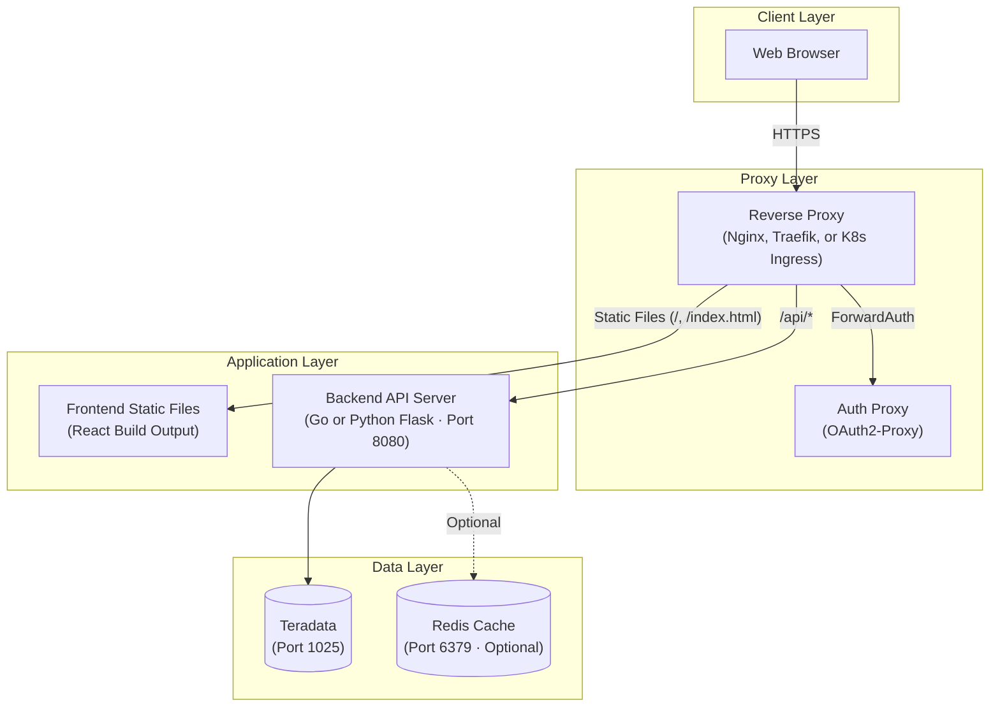

<objective>
Complete `docs/operations_guide.md` by adding Production Deployment, Architecture, and Troubleshooting sections.

Purpose: An operations team can harden the deployment for production (auth, TLS, CORS, rate limiting), understand the system topology from an architecture diagram, and diagnose common issues using the troubleshooting section.

Output: Completed `docs/operations_guide.md` with all 8 sections filled, satisfying OPS-09 through OPS-12 and completing Phase 26.
</objective>

<execution_context>
@/Users/Daniel.Tehan/.claude/get-shit-done/workflows/execute-plan.md
@/Users/Daniel.Tehan/.claude/get-shit-done/templates/summary.md
</execution_context>

<context>
@.planning/PROJECT.md
@.planning/ROADMAP.md
@.planning/phases/26-operations-guide/26-RESEARCH.md
@.planning/phases/26-operations-guide/26-01-SUMMARY.md

Source files:
@docs/SECURITY.md (summarize and link -- do NOT duplicate full content)
@docs/user_guide.md (troubleshooting section to consolidate)
@CLAUDE.md (architecture section)

Key research findings:
- SECURITY.md is 532 lines -- comprehensive. Summarize key requirements and link for details.
- Mermaid `graph TD` for deployment diagram (already used in root README, GitHub renders natively)
- CORS in dev: localhost:3000 and localhost:5173. Production: must restrict to exact origin.
- Rate limiting by endpoint: 5 categories with per-IP and per-user limits
- Existing troubleshooting in user_guide.md: 5 issues. Add ops-specific issues: Redis connection, port conflicts, Teradata driver, frontend build failures.
- Dev CORS is hardcoded in router.go -- production must override via proxy
</context>

<tasks>

<task type="auto">
  <name>Task 1: Add Production Deployment and Architecture sections</name>
  <files>docs/operations_guide.md</files>
  <action>
Replace the placeholder "Production Deployment" and "Architecture" sections in `docs/operations_guide.md`.

**Production Deployment section:**

Open with: "The application is designed to run behind a reverse proxy that handles authentication, TLS termination, rate limiting, and security headers. The application itself does NOT implement authentication -- this is intentional. See [Security Documentation](SECURITY.md) for complete configuration examples including Traefik + Docker Compose, Nginx, and Kubernetes Ingress."

**6.1 Security Overview:**
Provide a concise summary table of production security requirements:

| Requirement | Description | Details |
|-------------|-------------|---------|
| Authentication | API must be behind an auth proxy (OAuth2-Proxy, API Gateway) | [SECURITY.md - Authentication](SECURITY.md#2-authentication-requirements) |
| TLS | All traffic must use HTTPS (TLS 1.2 minimum, TLS 1.3 recommended) | [SECURITY.md - TLS](SECURITY.md#1-tls-requirements) |
| Security Headers | Reverse proxy must add HSTS, X-Content-Type-Options, X-Frame-Options, Referrer-Policy, Cache-Control | [SECURITY.md - Headers](SECURITY.md#4-security-headers) |
| CORS | Restrict allowed origins to your domain (never use wildcard `*`) | [SECURITY.md - CORS](SECURITY.md#5-cors-configuration) |
| Rate Limiting | Configure per-endpoint rate limits at the proxy level | See Rate Limiting below |

Note: The application's built-in CORS configuration (`localhost:3000`, `localhost:5173`) is for development only. In production, CORS must be configured at the reverse proxy level with your actual domain.

**6.2 Rate Limiting:**
Document rate limiting recommendations by endpoint:

| Endpoint | Per-IP Limit | Per-User Limit | Rationale |
|----------|-------------|----------------|-----------|
| `GET /api/v*/assets/*` | 100/min | 300/min | Normal browsing |
| `GET /api/v*/lineage/{id}` | 100/min | 300/min | Normal browsing |
| `GET /api/v*/search` | 30/min | 60/min | Heavier database queries |
| `GET /api/v*/lineage/{id}/impact` | 20/min | 40/min | Expensive recursive queries |
| `GET /health` | 1000/min | unlimited | Monitoring systems |

Note: Allow burst of 10-20 requests above limits. Use sliding window algorithm for smoother limiting.

**6.3 Frontend Production Serving:**
Document how to serve the frontend in production:

```bash
# Build static files
cd lineage-ui
npm run build    # Outputs to dist/
```

The `dist/` directory contains static HTML, CSS, and JavaScript. Configure your reverse proxy to:
1. Serve files from `dist/` for all non-API paths
2. Proxy `/api/*` requests to the backend (port 8080 by default)
3. Return `index.html` for all client-side routes (SPA fallback)

Example Nginx location block:
```nginx
# Serve frontend static files
location / {
    root /path/to/lineage-ui/dist;
    try_files $uri $uri/ /index.html;
}

# Proxy API requests to backend
location /api/ {
    proxy_pass http://127.0.0.1:8080;
    proxy_set_header Host $host;
    proxy_set_header X-Real-IP $remote_addr;
}
```

**6.4 Deployment Checklist:**
Provide a pre-launch checklist:

```markdown
- [ ] Teradata credentials configured and tested
- [ ] QVCI enabled on Teradata instance
- [ ] OL_* schema created and lineage data populated
- [ ] Backend starts without errors
- [ ] Frontend built (`npm run build`)
- [ ] Reverse proxy configured with TLS
- [ ] Authentication proxy configured and tested
- [ ] Rate limiting configured
- [ ] Security headers verified (see SECURITY.md verification checklist)
- [ ] Health endpoint accessible: `curl https://your-domain/health`
```

**Architecture section:**

Add a Mermaid deployment architecture diagram:



Below the diagram, add a brief description of each layer:

- **Client Layer:** Web browsers access the application over HTTPS.
- **Proxy Layer:** Reverse proxy terminates TLS, enforces authentication via ForwardAuth to an OAuth2-Proxy, applies rate limiting, and injects security headers.
- **Application Layer:** Frontend is static files built from React. Backend is a Go or Python Flask server providing REST API endpoints. The frontend proxies API requests through the reverse proxy.
- **Data Layer:** Teradata stores lineage metadata in OL_* tables. Redis provides optional caching for the Go backend (not used by the Python backend).

Add a "Component Communication" subsection:

| From | To | Protocol | Port |
|------|----|----------|------|
| Browser | Reverse Proxy | HTTPS | 443 |
| Reverse Proxy | Auth Proxy | HTTP | 4180 |
| Reverse Proxy | Frontend Files | File system | -- |
| Reverse Proxy | Backend API | HTTP | 8080 |
| Backend API | Teradata | TCP (Teradata) | 1025 |
| Backend API | Redis (optional) | TCP (Redis) | 6379 |
  </action>
  <verify>
Read `docs/operations_guide.md` and confirm:
1. Production Deployment section links to SECURITY.md (not duplicating full content)
2. Security overview table has 5 requirement rows with links to SECURITY.md sections
3. Rate limiting table has 5 endpoint categories with per-IP and per-user limits
4. Frontend production serving documents `npm run build` + Nginx example
5. Deployment checklist has 10 items
6. Architecture section has Mermaid `graph TD` diagram with 4 layers
7. Component Communication table lists 6 communication paths
8. CORS development-only warning is present
  </verify>
  <done>
Production Deployment section provides security summary with SECURITY.md links, rate limiting by endpoint, frontend production serving guide, and deployment checklist. Architecture section has Mermaid deployment diagram with layer descriptions and communication table.
  </done>
</task>

<task type="auto">
  <name>Task 2: Add Troubleshooting section and remove "coming in v5.0" from README link</name>
  <files>docs/operations_guide.md, README.md</files>
  <action>
**1. Replace the placeholder "Troubleshooting" section in `docs/operations_guide.md`:**

Add a comprehensive troubleshooting section with common operational issues. Each issue should have: Problem, Symptoms, Cause, Solution.

**Issue 1: Cannot Connect to Teradata**
- Symptoms: `Connection refused` or `Login failure` errors on backend startup
- Cause: Incorrect hostname, port, or credentials in configuration
- Solution: Verify `TERADATA_HOST`, `TERADATA_USER`, `TERADATA_PASSWORD` in `.env`. Test connectivity: `python -c "import teradatasql; teradatasql.connect(host='YOUR_HOST', user='YOUR_USER', password='YOUR_PASS')"`. Check firewall rules for port 1025.

**Issue 2: QVCI Feature is Disabled (Error 9719)**
- Symptoms: `populate_lineage.py` fails with error 9719 during metadata extraction
- Cause: QVCI is not enabled on the Teradata instance
- Solution: See Database Setup > Verify QVCI Status. Requires DBA to run `dbscontrol` and restart the database. Alternatively, modify `populate_lineage.py` to use `DBC.ColumnsV` instead of `DBC.ColumnsJQV` (see CLAUDE.md for fallback instructions).

**Issue 3: Empty Lineage Graph**
- Symptoms: Graph page shows "No lineage data found" or renders no edges
- Cause: OL_COLUMN_LINEAGE table is empty or not populated for the selected column
- Solution: Run `populate_lineage.py` to populate lineage data. Verify data exists: `SELECT COUNT(*) FROM OL_COLUMN_LINEAGE;`. For DBQL mode, ensure the Teradata user has SELECT on `DBC.DBQLogTbl` and `DBC.DBQLSQLTbl`.

**Issue 4: Port Already in Use**
- Symptoms: `Address already in use` error when starting the backend
- Cause: Another process is using port 8080
- Solution: Change `API_PORT` in `.env` or stop the conflicting process: `lsof -i :8080` (macOS/Linux) to identify it.

**Issue 5: Redis Connection Failed**
- Symptoms: Warning in Go backend logs about Redis connection failure
- Cause: Redis is not running or not reachable at configured `REDIS_ADDR`
- Solution: This is non-fatal -- the application falls back to no caching. To enable Redis: start Redis server and verify `REDIS_ADDR` in `.env`. To silence the warning: Redis is only used by the Go backend. The Python backend does not use Redis.

**Issue 6: Frontend Build Fails**
- Symptoms: `npm run build` fails with errors
- Cause: Missing dependencies or incompatible Node.js version
- Solution: Verify Node.js 18+: `node --version`. Delete `node_modules` and reinstall: `rm -rf node_modules && npm install`. Check for TypeScript errors: `npm run type-check` (if available) or review the build output.

**Issue 7: Slow Graph Loading**
- Symptoms: Large lineage graphs take more than 30 seconds to render
- Cause: Deep lineage traversal or wide fan-out patterns
- Solution: Reduce the traversal depth in the UI toolbar (default is 5, try 3). For the Go backend, configure `VALIDATION_DEFAULT_MAX_DEPTH` to a lower value. Consider Redis caching for frequently accessed graphs.

**Issue 8: Frontend Cannot Reach Backend API**
- Symptoms: Network errors in the browser console, "Loading..." spinner never resolves
- Cause: Backend not running, wrong port, or CORS misconfiguration
- Solution: Verify backend is running: `curl http://localhost:8080/health`. In development, Vite proxies `/api/*` to `localhost:8080` automatically. In production, verify the reverse proxy routes `/api/*` to the backend.

**Issue 9: Teradata Driver Not Found**
- Symptoms: `ModuleNotFoundError: No module named 'teradatasql'` when running Python scripts
- Cause: Python virtual environment not activated or dependencies not installed
- Solution: Activate the virtual environment: `source .venv/bin/activate`. Install dependencies: `pip install -r requirements.txt`. Verify installation: `python -c "import teradatasql; print(teradatasql.__version__)"`.

**Issue 10: Schema Already Exists**
- Symptoms: `setup_lineage_schema.py` fails with "table already exists" errors
- Cause: Running schema setup on a database that already has OL_* tables
- Solution: The script is idempotent for indexes but not for tables. If you need to recreate, drop the existing OL_* tables first. Back up any existing lineage data before dropping.

**2. Update root README.md:**
Remove the "(coming in v5.0)" annotation from the operations guide link. Change:
```
| [Operations Guide](docs/operations_guide.md) | Deployment and configuration (coming in v5.0) |
```
To:
```
| [Operations Guide](docs/operations_guide.md) | Deployment, configuration, and production hardening |
```
  </action>
  <verify>
Read `docs/operations_guide.md` and confirm:
1. Troubleshooting section has 10 issues
2. Each issue has Problem/Symptoms/Cause/Solution structure
3. QVCI troubleshooting references Database Setup section
4. Redis issue notes it is non-fatal
5. Frontend API connectivity issue covers both dev proxy and production proxy

Read `README.md` and confirm:
6. Operations Guide link no longer says "coming in v5.0"
7. Operations Guide link description says "Deployment, configuration, and production hardening"
  </verify>
  <done>
Troubleshooting section covers 10 common operational issues. README.md updated to remove "coming in v5.0" from operations guide link. All OPS requirements (OPS-01 through OPS-12) satisfied. Phase 26 complete.
  </done>
</task>

</tasks>

<verification>
After both tasks complete:
1. Read the full `docs/operations_guide.md` and verify all 8 TOC sections are filled (no placeholders remain)
2. Verify no broken markdown formatting or unclosed code blocks
3. Verify requirement coverage:
   - OPS-09: Production security requirements summarized with links to SECURITY.md
   - OPS-10: Rate limiting documented by endpoint category
   - OPS-11: Mermaid deployment architecture diagram present
   - OPS-12: Troubleshooting section with 10 common issues
4. Verify SECURITY.md content is summarized and linked, NOT duplicated
5. Verify README.md no longer has "coming in v5.0" for operations guide
6. Count total document lines -- should be approximately 800-900 lines based on research estimate
</verification>

<success_criteria>
- docs/operations_guide.md has all 8 sections filled with no placeholders
- Production Deployment summarizes security and links to SECURITY.md
- Rate limiting table has 5 endpoint categories
- Mermaid deployment architecture diagram renders correctly
- Troubleshooting has 10 issues with symptoms/cause/solution
- README.md operations guide link updated (no "coming in v5.0")
- All OPS-01 through OPS-12 requirements satisfied
</success_criteria>

<output>
After completion, create `.planning/phases/26-operations-guide/26-02-SUMMARY.md`
</output>
