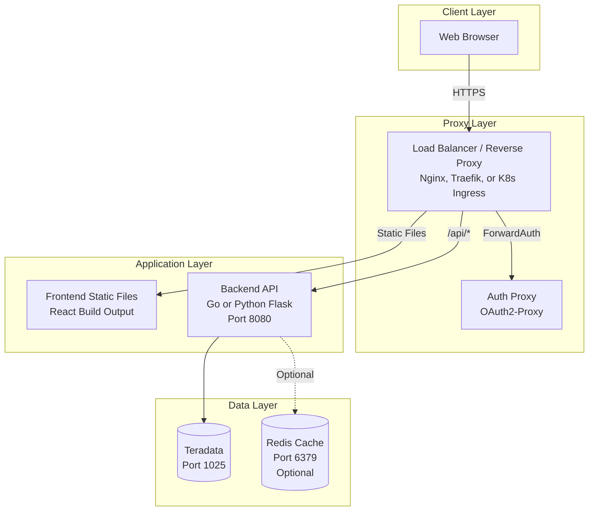

# Phase 26: Operations Guide - Research

**Researched:** 2026-02-08
**Domain:** Documentation / Operations and deployment documentation
**Confidence:** HIGH

## Summary

This phase creates `docs/operations_guide.md` to enable an operations team to deploy the lineage application to production from scratch. Research involved comprehensive reading of every source file related to deployment, configuration, security, database setup, and troubleshooting across the entire codebase.

The project already has extensive raw material scattered across multiple files: `CLAUDE.md` (configuration reference, quick start, architecture), `docs/SECURITY.md` (complete production security requirements with Nginx/Traefik/K8s examples), `docs/user_guide.md` (getting started, environment variables, troubleshooting), `.env.example` (all environment variables), and individual source files (`config.go`, `db_config.py`, `python_server.py`, `vite.config.ts`). The operations guide consolidates, restructures, and extends this content into a single coherent document organized for operational workflows rather than developer exploration.

The guide does NOT exist yet (the root `README.md` links to `docs/operations_guide.md` with a "coming in v5.0" note). This is a net-new document. The ROADMAP already has a suggested 2-plan split: plan 01 covering prerequisites/installation/configuration, and plan 02 covering database setup/security/architecture diagram/troubleshooting.

**Primary recommendation:** Create a single `docs/operations_guide.md` file organized into operational sections (prerequisites, installation, configuration, database setup, lineage population, production hardening, architecture diagram, troubleshooting). Source content from existing files but restructure for ops team consumption. Use Mermaid for the deployment architecture diagram. Do NOT duplicate the full SECURITY.md content -- reference it and provide an executive summary.

## Standard Stack

This is a documentation-only phase. No libraries are installed.

### Core Tools
| Tool | Purpose | Why Standard |
|------|---------|--------------|
| Markdown | Documentation format | Used throughout project, GitHub renders natively |
| Mermaid | Architecture diagrams | GitHub renders Mermaid natively in markdown, already used in root README |

### Supporting
| Tool | Purpose | When to Use |
|------|---------|-------------|
| ASCII art | Fallback diagrams | For any diagram that Mermaid cannot express well |

### Alternatives Considered
| Instead of | Could Use | Tradeoff |
|------------|-----------|----------|
| Mermaid diagrams | PNG/SVG images | Mermaid is text-based (diffable, no binary blobs), GitHub renders natively |
| Single ops guide | Multiple ops docs | Single file is easier to find and follow end-to-end; TOC provides navigation |
| C4 Deployment diagram | Mermaid `graph` diagram | C4 is more semantically precise but `graph` is simpler and already used in the repo |

## Architecture Patterns

### Document Structure (Target)
```
docs/
├── operations_guide.md   # PRIMARY TARGET - new file
├── user_guide.md         # Already exists (not in scope)
├── SECURITY.md           # Already exists (referenced, not duplicated)
└── screenshots/          # Already exists (not relevant to ops guide)
```

### Pattern: Operational Workflow Sections

The ops guide should follow the deployment lifecycle, not the developer exploration path. Each section answers a specific operational question:

| Section | Operational Question |
|---------|---------------------|
| Prerequisites | "What do I need installed before starting?" |
| Installation | "How do I get the code and build it?" |
| Configuration | "What environment variables control behavior?" |
| Database Setup | "How do I create the schema and populate data?" |
| Running the Application | "How do I start the backend and frontend?" |
| Production Deployment | "How do I harden this for production?" |
| Architecture | "What is the system topology?" |
| Monitoring & Health | "How do I know if it's working?" |
| Troubleshooting | "Something is broken -- how do I fix it?" |

### Pattern: Requirement-to-Section Mapping

Each OPS requirement maps to specific sections of the new ops guide:

| Requirement | Target Section | Source Material |
|-------------|---------------|-----------------|
| OPS-01: Prerequisites | Prerequisites | `CLAUDE.md` Quick Start, `user_guide.md` Prerequisites, `go.mod` (Go 1.23), `package.json` (Node 18+), `requirements.txt` (Python deps) |
| OPS-02: Installation | Installation | `CLAUDE.md` Quick Start, `Makefile` (Go build), `package.json` (npm scripts) |
| OPS-03: TERADATA_* env vars | Configuration > Teradata | `.env.example`, `config.go`, `db_config.py`, `user_guide.md` Configuration Reference |
| OPS-04: API_PORT and server config | Configuration > Server | `.env.example`, `config.go`, `main.go` (server timeouts) |
| OPS-05: Redis config | Configuration > Redis | `.env.example`, `config.go`, `config.yaml` |
| OPS-06: Database schema (OL_*) | Database Setup > Schema | `setup_lineage_schema.py` (complete DDL), `CLAUDE.md` OpenLineage Schema |
| OPS-07: Lineage population | Database Setup > Population | `CLAUDE.md` populate commands, `user_guide.md` DBQL section |
| OPS-08: QVCI requirements | Database Setup > QVCI | `CLAUDE.md` QVCI section (complete), `user_guide.md` QVCI troubleshooting |
| OPS-09: Production security | Production > Security | `docs/SECURITY.md` (complete -- reference, don't duplicate) |
| OPS-10: Rate limiting | Production > Rate Limiting | `docs/SECURITY.md` rate limiting section |
| OPS-11: Architecture diagram | Architecture | New Mermaid diagram based on `CLAUDE.md` architecture + `SECURITY.md` proxy patterns |
| OPS-12: Troubleshooting | Troubleshooting | `user_guide.md` Troubleshooting + new ops-specific issues |

### Anti-Patterns to Avoid
- **Duplicating SECURITY.md in full:** The ops guide should summarize security requirements and link to SECURITY.md for details. Copy-pasting creates maintenance burden and drift.
- **Developer-oriented language:** Ops guide readers are deploying, not developing. Avoid "clone the repo and hack on it" language. Use "deploy the application" framing.
- **Incomplete environment variable docs:** Every env var must document: name, description, default value, required/optional, and which component uses it.
- **Missing version numbers:** Pin specific version requirements (Go 1.23+, Node.js 18+, Python 3.9+) rather than "latest."

## Don't Hand-Roll

Problems that look simple but have existing solutions:

| Problem | Don't Build | Use Instead | Why |
|---------|-------------|-------------|-----|
| Architecture diagram | Static PNG image | Mermaid in markdown | Diffable, no binary blob, GitHub renders natively |
| Security requirements | Rewrite from scratch | Reference `docs/SECURITY.md` | SECURITY.md is comprehensive and authoritative; summarize and link |
| Environment variable docs | Manual list | Extract from `.env.example` + `config.go` + `db_config.py` | These are the single sources of truth |
| QVCI documentation | Write new QVCI guide | Consolidate from `CLAUDE.md` QVCI section | CLAUDE.md has the complete QVCI guide including dbscontrol commands |
| Troubleshooting | Write from scratch | Consolidate from `user_guide.md` troubleshooting + add ops-specific | Existing troubleshooting is good; extend it for ops scenarios |

**Key insight:** ~80% of the content for this ops guide already exists in `CLAUDE.md`, `SECURITY.md`, `user_guide.md`, and `.env.example`. The task is consolidation, restructuring, and gap-filling, not original authoring.

## Common Pitfalls

### Pitfall 1: Content Drift Between Docs
**What goes wrong:** Ops guide documents env vars differently from `.env.example` or `CLAUDE.md`, creating contradictions.
**Why it happens:** Copy-pasting configuration info without linking to a single source of truth.
**How to avoid:** For security details, link to `SECURITY.md` rather than restating. For env vars, treat `.env.example` as the canonical list and ensure consistency.
**Warning signs:** The ops guide says a default is "X" but `.env.example` shows "Y".

### Pitfall 2: Missing the Python Server Option
**What goes wrong:** Ops guide only documents the Go server, ignoring that the Python Flask server is a first-class alternative.
**Why it happens:** Go is described as the "production" backend in specs.
**How to avoid:** Document BOTH server options. The Python server uses the same API endpoints and is simpler to deploy (no compilation step). Many users may prefer it.
**Warning signs:** Guide mentions `go build` but not `python python_server.py`.

### Pitfall 3: QVCI as a Blocking Surprise
**What goes wrong:** Ops team follows the guide, gets to `populate_lineage.py`, and hits error 9719 (QVCI disabled) with no prior warning.
**Why it happens:** QVCI is a DBA-level Teradata configuration that requires a database restart -- needs advance planning.
**How to avoid:** Call out QVCI in the Prerequisites section as something to verify BEFORE starting deployment. Put the QVCI check and enablement in Database Setup as an early step, not buried after schema creation.
**Warning signs:** QVCI mentioned only in troubleshooting, not in prerequisites.

### Pitfall 4: Frontend Production Build vs Dev Server
**What goes wrong:** Ops guide tells production teams to run `npm run dev` instead of building static assets and serving via a web server.
**Why it happens:** Dev server is the easiest "it works" path.
**How to avoid:** Document both: `npm run dev` for development/testing, and `npm run build` + static file serving for production. The production frontend is static files that can be served by Nginx, not a running Node.js process.
**Warning signs:** No mention of `npm run build` or static file serving.

### Pitfall 5: Incomplete Prerequisite Versions
**What goes wrong:** Ops team installs the wrong version of Go, Node.js, or Python and gets cryptic errors.
**Why it happens:** Prerequisites say "Node.js" without specifying minimum version.
**How to avoid:** Pin minimum versions based on actual usage: Go 1.23+ (from `go.mod`), Node.js 18+ (from `package.json` engines and user guide), Python 3.9+ (from user guide).
**Warning signs:** Version errors during `go build` or `npm install`.

### Pitfall 6: Redis Described as Required
**What goes wrong:** Ops team blocks on Redis setup, delays deployment.
**Why it happens:** Redis is listed in config but its optional nature isn't emphasized.
**How to avoid:** Clearly state Redis is OPTIONAL. Application falls back gracefully if Redis is unavailable. Only beneficial for caching in high-traffic production deployments.
**Warning signs:** Prerequisites list Redis as required.

## Code Examples

### Verified Deployment Architecture Diagram (Mermaid)

The root `README.md` already uses a Mermaid `graph LR` diagram. The ops guide needs a more detailed deployment architecture diagram showing the production topology. Use Mermaid `graph TD` for a top-down deployment view:



Source: Synthesized from `CLAUDE.md` architecture section and `docs/SECURITY.md` deployment patterns.

### Verified Environment Variable Table

From `.env.example` and `config.go`:

```markdown
| Variable | Description | Default | Required | Used By |
|----------|-------------|---------|----------|---------|
| `TERADATA_HOST` | Teradata hostname | -- | Yes | All |
| `TERADATA_USER` | Teradata username | `demo_user` | No | All |
| `TERADATA_PASSWORD` | Teradata password | -- | Yes | All |
| `TERADATA_DATABASE` | Default database | `demo_user` | No | All |
| `TERADATA_PORT` | Teradata port | `1025` | No | All |
| `API_PORT` | HTTP server port | `8080` | No | Backend |
| `REDIS_ADDR` | Redis address | `localhost:6379` | No | Go backend |
| `REDIS_PASSWORD` | Redis password | (empty) | No | Go backend |
| `REDIS_DB` | Redis database number | `0` | No | Go backend |
| `VALIDATION_MAX_DEPTH_LIMIT` | Max depth upper bound | `20` | No | Go backend |
| `VALIDATION_DEFAULT_MAX_DEPTH` | Default traversal depth | `5` | No | Go backend |
| `VALIDATION_MIN_MAX_DEPTH` | Min depth lower bound | `1` | No | Go backend |
```

Source: `/Users/Daniel.Tehan/Code/lineage/.env.example` and `/Users/Daniel.Tehan/Code/lineage/lineage-api/internal/infrastructure/config/config.go`

### Verified Server Timeouts (from main.go)

```go
// Source: lineage-api/cmd/server/main.go lines 66-72
server := &http.Server{
    Addr:         ":" + cfg.Port,
    Handler:      router,
    ReadTimeout:  15 * time.Second,
    WriteTimeout: 60 * time.Second,
    IdleTimeout:  60 * time.Second,
}
// Graceful shutdown timeout: 30 seconds (line 87)
```

### Verified OL_* Tables (from setup_lineage_schema.py)

The 9 OpenLineage tables created by the schema setup script:

| Table | Purpose |
|-------|---------|
| `OL_NAMESPACE` | Data source namespaces (teradata://host:port) |
| `OL_DATASET` | Dataset registry (tables/views) |
| `OL_DATASET_FIELD` | Field definitions (columns) |
| `OL_JOB` | Job definitions (ETL processes) |
| `OL_RUN` | Job execution runs |
| `OL_RUN_INPUT` | Run input datasets |
| `OL_RUN_OUTPUT` | Run output datasets |
| `OL_COLUMN_LINEAGE` | Column-level lineage with transformation types |
| `OL_SCHEMA_VERSION` | Schema version tracking |

Source: `/Users/Daniel.Tehan/Code/lineage/database/scripts/setup/setup_lineage_schema.py`

### Verified CORS Configuration (from router.go)

```go
// Source: lineage-api/internal/adapter/inbound/http/router.go lines 16-23
// Development CORS -- must be replaced for production
cors.Options{
    AllowedOrigins:   []string{"http://localhost:3000", "http://localhost:5173"},
    AllowedMethods:   []string{"GET", "POST", "PUT", "DELETE", "OPTIONS"},
    AllowedHeaders:   []string{"Accept", "Authorization", "Content-Type", "X-Request-ID"},
    ExposedHeaders:   []string{"Link"},
    AllowCredentials: true,
    MaxAge:           300,
}
```

### Verified Config Precedence (from config.go)

Configuration sources, highest to lowest precedence:
1. Environment variables
2. `.env` file (project root)
3. `config.yaml` file (Go server only)
4. Default values

Source: `/Users/Daniel.Tehan/Code/lineage/lineage-api/internal/infrastructure/config/config.go` line 29 comment and `loadDotEnv()` function.

## State of the Art

| Old Approach | Current Approach | When Changed | Impact |
|--------------|------------------|--------------|--------|
| `TD_*` env vars | `TERADATA_*` env vars | Phase 7-8 (v2.0) | Legacy `TD_*` still supported as fallback |
| `LIN_*` tables | `OL_*` tables | Phase 1-6 (v1.0) | OpenLineage-aligned schema; `--openlineage` flag required |
| `PORT` env var | `API_PORT` env var | Phase 7-8 (v2.0) | Legacy `PORT` still supported as fallback |
| v1 API only | v1 + v2 API | Phase 1-6 (v1.0) | v2 is OpenLineage-aligned; v1 is backward compatible |

**Deprecated/outdated:**
- `LIN_*` tables: Replaced by `OL_*` tables. Do NOT document `LIN_*` in ops guide.
- `TD_*` env vars: Still work but deprecated. Document `TERADATA_*` as primary with note about `TD_*` fallback.
- `PORT` env var: Still works but deprecated. Document `API_PORT` as primary.

## Content Gap Analysis

What the ops guide needs that does NOT exist in any current document:

| Gap | What's Needed | How to Fill |
|-----|---------------|-------------|
| Deployment architecture diagram | Visual showing proxy + app + data layers | Create Mermaid diagram (see Code Examples above) |
| Production frontend deployment | How to build and serve static files in production | Document `npm run build` + Nginx/reverse proxy serving `dist/` |
| Monitoring setup | How to verify the system is healthy in production | Document `/health` endpoint, log monitoring, Redis connectivity check |
| Backup/restore procedures | How to back up OL_* tables | Document Teradata backup of OL_* tables (standard Teradata DBA procedure) |
| Log output format | What logs look like and how to configure | Document Go server structured JSON logging, Python Flask logging |
| Startup order | Which components to start in what order | Document: Database (already running) -> Backend -> Frontend |
| Upgrade procedures | How to update to a new version | Basic git pull + rebuild + restart procedure |

## Existing Content Inventory

Detailed inventory of what already exists and where, to avoid re-authoring:

### Prerequisites Information
- **Go version:** `go.mod` says `go 1.23.0` -- use Go 1.23+
- **Node.js version:** `user_guide.md` says Node.js 18+ -- confirmed by package.json engine compatibility
- **Python version:** `user_guide.md` says Python 3.9+
- **Python deps:** `requirements.txt` lists: `teradatasql>=17.20.0`, `flask>=3.0.0`, `flask-cors>=4.0.0`, `requests>=2.31.0`, `python-dotenv>=1.0.0`, `sqlglot>=25.0.0`

### Configuration Information
- **Complete env var list:** `.env.example` (all vars with comments)
- **Config precedence:** `config.go` lines 29-51 (env > .env > config.yaml > defaults)
- **Legacy fallbacks:** `config.go` lines 53-59 (TD_* and PORT)
- **Validation config:** `config.go` lines 46-48 and `.env.example` lines 43-46
- **Go config.yaml:** `lineage-api/config.yaml` (7 lines)
- **Server timeouts:** `main.go` lines 66-72 (15s read, 60s write, 60s idle, 30s shutdown)
- **Teradata connection pooling:** CLAUDE.md says max open=25, max idle=5

### Database Setup Information
- **Schema script:** `setup_lineage_schema.py` (complete DDL for 9 tables + 17 indexes)
- **Test data script:** `setup_test_data.py` (creates SRC/STG/DIM/FACT tables)
- **Population modes:** `populate_lineage.py` (fixtures default, --dbql for DBQL mode)
- **QVCI guide:** `CLAUDE.md` QVCI section (complete: what, check, enable, fallback)

### Security Information
- **SECURITY.md:** Complete production security guide (532 lines) covering:
  - TLS requirements (TLS 1.2+ minimum, TLS 1.3 recommended, HSTS)
  - Authentication proxy patterns (ForwardAuth, API Gateway, Reverse Proxy + OIDC)
  - Rate limiting by endpoint (5 endpoint categories with per-IP and per-user limits)
  - Security headers (6 required, 2 to remove)
  - CORS configuration (dev vs production)
  - Example configs: Traefik + Docker Compose, Nginx, Kubernetes Ingress
  - Verification checklist (8 items with curl commands)

### Troubleshooting Information
- **user_guide.md Troubleshooting:** 5 issues (connection, empty lineage, slow performance, graph rendering, QVCI)
- **Additional ops issues to add:** Redis connection failure, port conflicts, Teradata driver issues, frontend build failures

## Document Size Estimate

Based on the source material and requirements:

| Section | Estimated Lines | Source |
|---------|----------------|--------|
| Header + TOC | ~30 | New |
| Prerequisites | ~80 | Consolidate from CLAUDE.md + user_guide.md |
| Installation | ~100 | Consolidate + new build/serve instructions |
| Configuration | ~120 | Consolidate from .env.example + config.go + user_guide.md |
| Database Setup | ~150 | Consolidate from CLAUDE.md + setup scripts |
| Running the Application | ~80 | Consolidate from CLAUDE.md + user_guide.md |
| Production Deployment | ~100 | Summary + links to SECURITY.md |
| Architecture Diagram | ~60 | New Mermaid diagram |
| Monitoring & Health | ~40 | New |
| Troubleshooting | ~120 | Extend from user_guide.md |
| **Total** | **~880** | Mix of consolidation and new |

## Recommended Plan Split

The ROADMAP already suggests two plans:

### Plan 26-01: Prerequisites, Installation, Configuration, Database Setup
- Create `docs/operations_guide.md` with TOC
- Write Prerequisites section (Go 1.23+, Node.js 18+, Python 3.9+, Teradata access, optional Redis)
- Write Installation section (clone, Python venv, Go build, frontend build)
- Write Configuration section (complete env var reference table with defaults/required/used-by)
- Write Database Setup section (QVCI check, schema creation, test data, lineage population)
- Write Running the Application section (both Go and Python backends, frontend dev vs build)
- Requirements covered: OPS-01, OPS-02, OPS-03, OPS-04, OPS-05, OPS-06, OPS-07, OPS-08

### Plan 26-02: Production Hardening, Architecture Diagram, Troubleshooting
- Write Production Deployment section (security summary, link to SECURITY.md, CORS, rate limiting)
- Write Architecture Diagram section (Mermaid deployment diagram)
- Write Monitoring & Health section (/health endpoint, logs, Redis check)
- Write Troubleshooting section (consolidated + new ops-specific issues)
- Requirements covered: OPS-09, OPS-10, OPS-11, OPS-12

## Open Questions

Things that could not be fully resolved:

1. **Frontend production serving strategy**
   - What we know: `npm run build` produces a `dist/` directory with static files
   - What's unclear: Should the ops guide recommend a specific strategy (Nginx serves static files + proxies API, or unified proxy)?
   - Recommendation: Document Nginx serving `dist/` for frontend + proxying `/api/*` to backend. This aligns with SECURITY.md Nginx example pattern.

2. **Log configuration in production**
   - What we know: Go server uses `slog` structured JSON logging (from `main.go` import of `logging` package). Python Flask uses standard Flask logging.
   - What's unclear: Whether log level is configurable via env var (would need to check logging package)
   - Recommendation: Document what we know (structured JSON logs from Go, Flask logs from Python). Flag log level config as needing verification during implementation.

3. **Database user permissions**
   - What we know: Teradata user needs access to OL_* tables and DBC system views (`DBC.TablesV`, `DBC.ColumnsJQV`, `DBC.DBQLogTbl`)
   - What's unclear: Exact GRANT statements needed for a production Teradata user
   - Recommendation: Document the required DBC view access. Note that DBQL access (`DBC.DBQLogTbl`, `DBC.DBQLSQLTbl`) is only needed for DBQL mode.

## Sources

### Primary (HIGH confidence)
- `/Users/Daniel.Tehan/Code/lineage/CLAUDE.md` - Complete project reference including architecture, env vars, QVCI, commands
- `/Users/Daniel.Tehan/Code/lineage/.env.example` - Canonical environment variable list with defaults
- `/Users/Daniel.Tehan/Code/lineage/docs/SECURITY.md` - Complete production security guide (532 lines)
- `/Users/Daniel.Tehan/Code/lineage/docs/user_guide.md` - Getting started, configuration, troubleshooting
- `/Users/Daniel.Tehan/Code/lineage/lineage-api/internal/infrastructure/config/config.go` - Go config loading with all defaults
- `/Users/Daniel.Tehan/Code/lineage/lineage-api/cmd/server/main.go` - Server setup, timeouts, graceful shutdown
- `/Users/Daniel.Tehan/Code/lineage/lineage-api/internal/adapter/inbound/http/router.go` - CORS config, API routes
- `/Users/Daniel.Tehan/Code/lineage/lineage-api/config.yaml` - Go server YAML config template
- `/Users/Daniel.Tehan/Code/lineage/lineage-api/Makefile` - Build/run/test commands
- `/Users/Daniel.Tehan/Code/lineage/lineage-api/go.mod` - Go 1.23, dependency versions
- `/Users/Daniel.Tehan/Code/lineage/lineage-ui/package.json` - Node.js dependencies and scripts
- `/Users/Daniel.Tehan/Code/lineage/lineage-ui/vite.config.ts` - Frontend proxy config
- `/Users/Daniel.Tehan/Code/lineage/requirements.txt` - Python dependencies
- `/Users/Daniel.Tehan/Code/lineage/database/db_config.py` - Python database config loading
- `/Users/Daniel.Tehan/Code/lineage/database/scripts/setup/setup_lineage_schema.py` - Complete DDL for 9 OL_* tables

### Secondary (MEDIUM confidence)
- [Mermaid C4 Deployment Diagrams](https://mermaid.js.org/syntax/c4.html) - C4 deployment diagram syntax
- [Mermaid Architecture Diagrams](https://mermaid.ai/open-source/syntax/architecture.html) - Architecture diagram syntax (v11.1.0+)
- [Mermaid Diagram Syntax Reference](https://mermaid.js.org/intro/syntax-reference.html) - General Mermaid syntax

### Tertiary (LOW confidence)
- [Writing Deployment and Support Requirements](https://qat.com/writing-deployment-support-requirements/) - General deployment documentation best practices
- [IT Documentation Best Practices 2026](https://www.ninjaone.com/blog/it-documentation-best-practices/) - General IT documentation guidance

## Metadata

**Confidence breakdown:**
- Standard stack: HIGH - Documentation-only phase, no library questions
- Architecture: HIGH - All source files read directly, configuration verified from code
- Pitfalls: HIGH - Based on direct observation of codebase gaps and common deployment mistakes
- Content inventory: HIGH - Every referenced file was read and verified
- Deployment diagram: MEDIUM - Mermaid `graph` syntax is well-established but the specific diagram is new

**Research date:** 2026-02-08
**Valid until:** 2026-03-08 (stable -- documentation phase with no dependency on external libraries)
