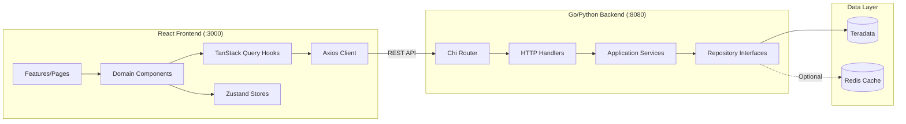
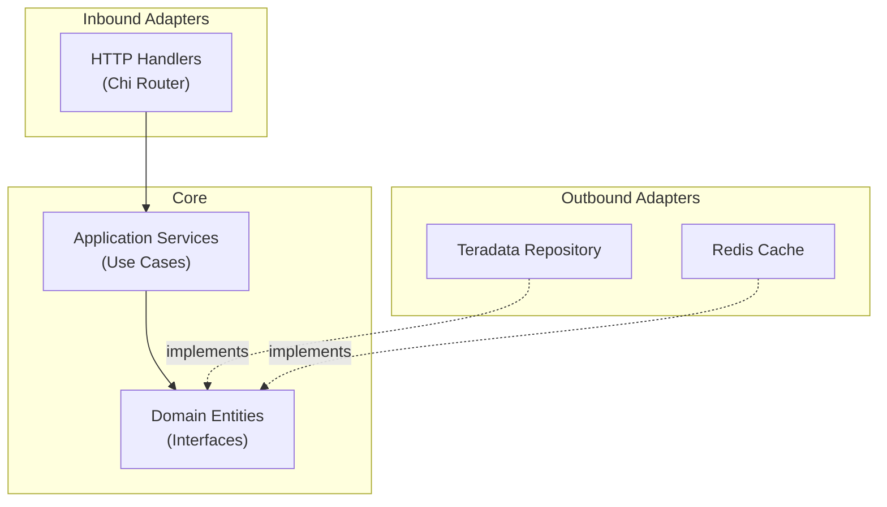
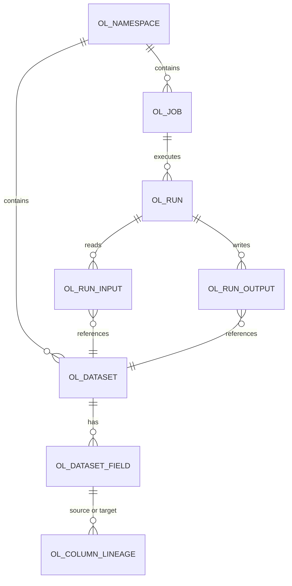

<objective>
Add architecture documentation, OpenLineage schema overview, API reference, and code standards to the developer manual.

Purpose: Enable a new developer to understand the system structure, navigate the codebase confidently, and write code that follows project conventions. Covers DEV-09 through DEV-13.
Output: ~440 lines added to `docs/developer_manual.md` covering Architecture Overview, Backend Architecture, Frontend Architecture, Database & Schema, API Reference, and Code Standards.
</objective>

<execution_context>
@/Users/Daniel.Tehan/.claude/get-shit-done/workflows/execute-plan.md
@/Users/Daniel.Tehan/.claude/get-shit-done/templates/summary.md
</execution_context>

<context>
@.planning/PROJECT.md
@.planning/ROADMAP.md
@.planning/STATE.md
@.planning/phases/27-developer-manual/27-RESEARCH.md
@.planning/phases/27-developer-manual/27-01-SUMMARY.md

# Source material for architecture and code standards
@CLAUDE.md
@lineage-api/README.md
@lineage-ui/README.md
@database/README.md
@specs/coding_standards_go.md
@specs/coding_standards_typescript.md
@specs/coding_standards_sql.md
@lineage-api/internal/domain/repository.go
@lineage-api/internal/domain/entities.go
</context>

<tasks>

<task type="auto">
  <name>Task 1: Write Architecture Overview, Backend Architecture, and Frontend Architecture sections</name>
  <files>docs/developer_manual.md</files>
  <action>
Add three sections to `docs/developer_manual.md` after the Running Tests section.

**## Architecture Overview (~40 lines):**

Opening: "The application follows a three-tier architecture: React frontend, Go/Python backend, and Teradata database with optional Redis caching."

Include a Mermaid system architecture diagram (from research):


Brief narrative explaining:
- Frontend communicates with backend via REST API
- Backend has two implementations: Python Flask (simpler, recommended for local dev) and Go with Chi router (production, hexagonal architecture)
- Both backends serve identical API endpoints and are interchangeable
- Redis is optional; the application falls back gracefully without it

**## Backend Architecture (~100 lines):**

**5.1 Hexagonal Architecture Pattern**
Explain the pattern conceptually: Core domain (entities + interfaces) has no external dependencies. Adapters implement the interfaces. This makes the core testable without a database.

Include a Mermaid diagram (from research):


**5.2 Directory Structure**
Include the verified backend directory tree from the research (the `lineage-api/internal/` tree). Include brief descriptions for each layer:
- **domain/** -- Core entities (Database, Table, Column, ColumnLineage, LineageGraph, OpenLineage types) and repository interfaces (AssetRepository, LineageRepository, SearchRepository, CacheRepository, OpenLineageRepository). No external dependencies.
- **application/** -- Service layer implementing use cases. DTOs define API request/response shapes. Services orchestrate domain operations.
- **adapter/inbound/http/** -- Chi router, HTTP handlers (v1 + v2), middleware, input validation, response helpers.
- **adapter/outbound/teradata/** -- Teradata repository implementations. Connection management, SQL queries.
- **adapter/outbound/redis/** -- Optional Redis cache implementation.
- **infrastructure/** -- Cross-cutting concerns: Viper config loading, slog structured logging.

**5.3 Key Interfaces**
List the 5 repository interfaces from `domain/repository.go` with brief descriptions:
- `AssetRepository` -- Browse databases, tables, columns
- `LineageRepository` -- Traverse lineage graph (upstream/downstream)
- `SearchRepository` -- Search across datasets
- `CacheRepository` -- Optional caching layer
- `OpenLineageRepository` -- OpenLineage-aligned dataset and field operations

Note: "Mock implementations in `domain/mocks/` enable testing services without a Teradata connection."

**5.4 Python Backend**
Brief section noting: Python Flask backend (`lineage-api/python_server.py`) serves the same API without the hexagonal architecture. It queries Teradata directly. Recommended for local development due to simpler setup (no Go compilation).

**## Frontend Architecture (~100 lines):**

**6.1 Technology Stack**
Brief list: React 18, TypeScript, Vite (build), TanStack Query (server state), Zustand (client state), React Flow / @xyflow/react (graph), ELKjs (layout).

**6.2 Directory Structure**
Include the verified frontend directory tree from the research (the `lineage-ui/src/` tree). Describe each layer:
- **api/** -- Axios HTTP client and TanStack Query hooks (useAssets, useLineage, useOpenLineage, useSearch). Hooks handle caching, loading states, and error handling.
- **components/common/** -- Reusable UI primitives (Button, Input, LoadingSpinner, Pagination, Tooltip, ErrorBoundary).
- **components/layout/** -- App chrome (AppShell, Header, Sidebar).
- **components/domain/** -- Feature-specific components. The largest is LineageGraph/ which includes TableNode, ColumnNode, edges, Toolbar, DetailPanel (with ColumnsTab, StatisticsTab, DDLTab), LineageTableView, and graph hooks.
- **features/** -- Page-level components bound to routes (ExplorePage, LineagePage, DatabaseLineagePage, etc.).
- **stores/** -- Zustand stores: `useLineageStore` (graph state: selection, depth, direction) and `useUIStore` (UI state: sidebar, panels, view mode).
- **utils/graph/** -- ELKjs layout engine integration and OpenLineage API adapter.

**6.3 Data Flow**
Explain the data flow pattern:
1. User navigates to a page (features/)
2. Page component calls a TanStack Query hook (api/hooks/)
3. Hook fetches from backend via Axios client (api/client.ts)
4. Response is transformed by adapter (utils/graph/openLineageAdapter.ts)
5. Graph components render using React Flow
6. Client-side state (selection, UI) managed by Zustand stores

**6.4 Key Patterns**
- TanStack Query for all server data (automatic caching, refetching, loading states)
- Zustand for client-only state (no server sync)
- React Flow custom nodes (TableNode with ColumnNode children)
- ELKjs for automatic graph layout (hierarchical/layered)
  </action>
  <verify>Architecture Overview has Mermaid system architecture diagram (```mermaid graph LR with Frontend, Backend, Data subgraphs). Backend Architecture has Mermaid hexagonal architecture diagram (```mermaid graph TD with Inbound, Core, Outbound subgraphs), directory tree, 5 repository interfaces listed. Frontend Architecture has directory tree, data flow explanation. All three diagram types required by DEV-16 are present: (1) system architecture covering frontend/backend/data, (2) hexagonal architecture diagram for backend, (3) ER diagram for database (in Task 2). Both sections reference source files, not abstract descriptions.</verify>
  <done>Architecture Overview, Backend Architecture, and Frontend Architecture sections document system structure with Mermaid diagrams, directory trees, and key patterns. Two of three DEV-16 diagrams are embedded (system architecture, hexagonal architecture).</done>
</task>

<task type="auto">
  <name>Task 2: Write Database & Schema, API Reference, and Code Standards sections</name>
  <files>docs/developer_manual.md</files>
  <action>
Add three more sections to `docs/developer_manual.md` after Frontend Architecture.

**## Database and Schema (~80 lines):**

**7.1 OpenLineage Alignment**
Explain: The database schema follows the [OpenLineage spec v2-0-2](https://openlineage.io/docs/spec/object-model). All lineage metadata tables use the `OL_` prefix.

Include the ER diagram from research:


**7.2 Table Reference**
Include the 9-table reference from research (table name, purpose, key fields) as a markdown table.

**7.3 Lineage Traversal**
Explain how lineage works:
- Column-level lineage stored in `OL_COLUMN_LINEAGE` (source_field_id -> target_field_id)
- Traversal uses recursive CTEs in Teradata
- Upstream: follows target_column_id -> source_column_id chain
- Downstream: follows source_column_id -> target_column_id chain
- Cycle detection via path tracking in the CTE
- Depth parameter controls how many levels to traverse

**7.4 Lineage Population**
Brief note about two modes (reference database/README.md for details):
- Fixtures mode (default): hardcoded mappings for demo/testing
- DBQL mode: extracts lineage from executed SQL in Teradata query logs

**## API Reference (~40 lines):**

**8.1 API Versioning**
- v1 API: Original endpoints (still available for backward compatibility)
- v2 API: OpenLineage-aligned (used by the frontend, recommended for new integrations)

**8.2 v2 Endpoints**
Table of endpoints:
| Method | Endpoint | Description |
|--------|----------|-------------|
| GET | `/api/v2/openlineage/namespaces` | List all namespaces |
| GET | `/api/v2/openlineage/namespaces/{namespaceId}` | Get namespace details |
| GET | `/api/v2/openlineage/namespaces/{namespaceId}/datasets` | List datasets in namespace |
| GET | `/api/v2/openlineage/datasets/{datasetId}` | Get dataset with fields |
| GET | `/api/v2/openlineage/datasets/search?q=query` | Search datasets |
| GET | `/api/v2/openlineage/lineage/{datasetId}/{fieldName}` | Get lineage graph |

Note: "See [lineage-api/README.md](../lineage-api/README.md) for complete endpoint documentation including v1 endpoints."

**## Code Standards (~80 lines):**

Opening: "The project maintains coding standards for all three languages. Full standards are documented in the `specs/` directory; this section summarizes key conventions."

**9.1 Go Standards**
Summary table of key conventions (extracted from research):
| Convention | Rule |
|-----------|------|
| Formatting | `gofmt`/`goimports` on save |
| Line length | 100 characters |
| Imports | Three groups: stdlib, third-party, internal |
| Errors | Wrap with `fmt.Errorf("context: %w", err)` |
| Test files | Colocated with source (`*_test.go`) |

Link: "Full standards: [specs/coding_standards_go.md](../specs/coding_standards_go.md)"

**9.2 TypeScript/React Standards**
Summary table:
| Convention | Rule |
|-----------|------|
| Formatting | Prettier + ESLint |
| Components | PascalCase, functional with hooks |
| Hooks | camelCase with `use` prefix |
| Test files | `*.test.tsx` colocated with source |
| Imports | 7 groups (React, external, internal, components, hooks, stores, types) |

Link: "Full standards: [specs/coding_standards_typescript.md](../specs/coding_standards_typescript.md)"

**9.3 SQL Standards**
Summary table:
| Convention | Rule |
|-----------|------|
| Naming | snake_case for all names |
| Keywords | UPPERCASE |
| Tables | `MULTISET` tables, `OL_` prefix for lineage system |
| Formatting | One clause per line, consistent indentation |

Link: "Full standards: [specs/coding_standards_sql.md](../specs/coding_standards_sql.md)"
  </action>
  <verify>Database & Schema section has Mermaid ER diagram (```mermaid erDiagram with OL_* tables -- this is the third DEV-16 diagram: database), 9-table reference, lineage traversal explanation. API Reference has v2 endpoint table. Code Standards has summary tables for Go, TypeScript, SQL. Each coding standards file is linked using a clickable markdown link with the correct relative path: `[specs/coding_standards_go.md](../specs/coding_standards_go.md)`, `[specs/coding_standards_typescript.md](../specs/coding_standards_typescript.md)`, `[specs/coding_standards_sql.md](../specs/coding_standards_sql.md)`. All three DEV-16 required diagram types are now present across Tasks 1 and 2: system architecture (frontend/backend/data), hexagonal architecture (backend), ER diagram (database).</verify>
  <done>Database & Schema, API Reference, and Code Standards sections complete. OpenLineage schema documented with ER diagram (third DEV-16 diagram), API endpoints listed, coding conventions summarized with clickable links to canonical specs using correct relative paths (../specs/).</done>
</task>

</tasks>

<verification>
1. Architecture Overview section has Mermaid system architecture diagram (graph LR with Frontend/Backend/Data subgraphs)
2. Backend Architecture explains hexagonal pattern with Mermaid hexagonal diagram (graph TD with Inbound/Core/Outbound), directory tree, 5 repository interfaces
3. Frontend Architecture has directory tree, technology stack, data flow, key patterns
4. Database & Schema has Mermaid ER diagram (erDiagram with OL_* tables), 9-table reference, lineage traversal explanation
5. All three DEV-16 diagram types are present and embedded as Mermaid code blocks: (a) system architecture, (b) hexagonal architecture, (c) database ER diagram
6. API Reference lists all v2 endpoints with methods and descriptions
7. Code Standards summarizes conventions for Go, TypeScript, and SQL
8. Each code standards subsection links to the canonical specs/ file using correct relative paths: `../specs/coding_standards_go.md`, `../specs/coding_standards_typescript.md`, `../specs/coding_standards_sql.md`
9. No content duplicated from operations guide
10. Architecture sections explain "why" patterns exist, not just "what" files do
</verification>

<success_criteria>
A new developer reading these sections can:
1. Understand the three-tier system architecture from the overview diagram
2. Navigate the Go backend knowing which layer to find or create code in
3. Navigate the React frontend knowing the component/feature/store/hook pattern
4. Understand the OpenLineage schema and how lineage traversal works
5. Look up v2 API endpoints for integration work
6. Write code following project conventions (or know where to find full standards)
</success_criteria>

<output>
After completion, create `.planning/phases/27-developer-manual/27-02-SUMMARY.md`
</output>
