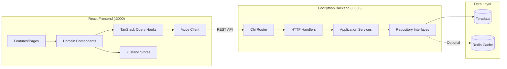
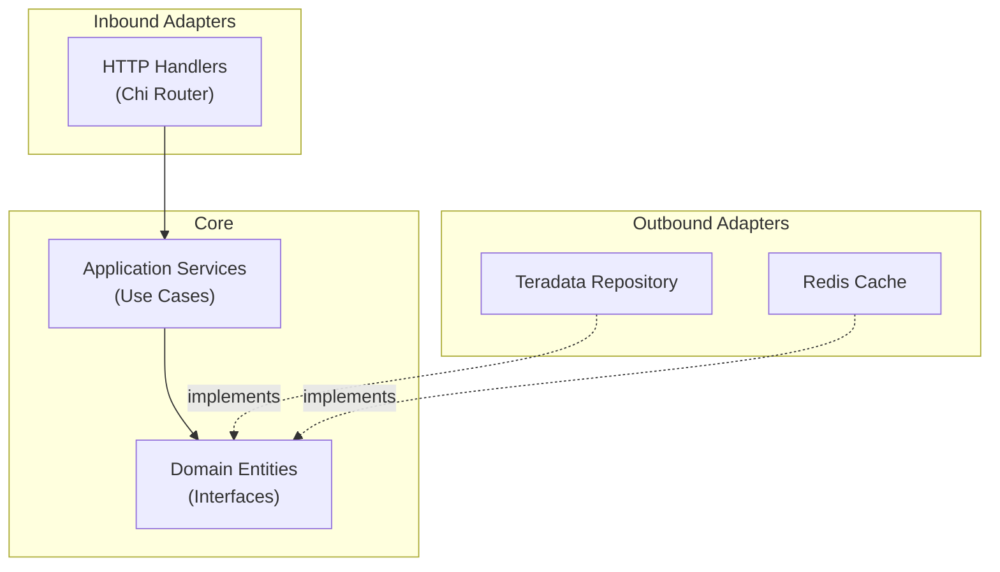
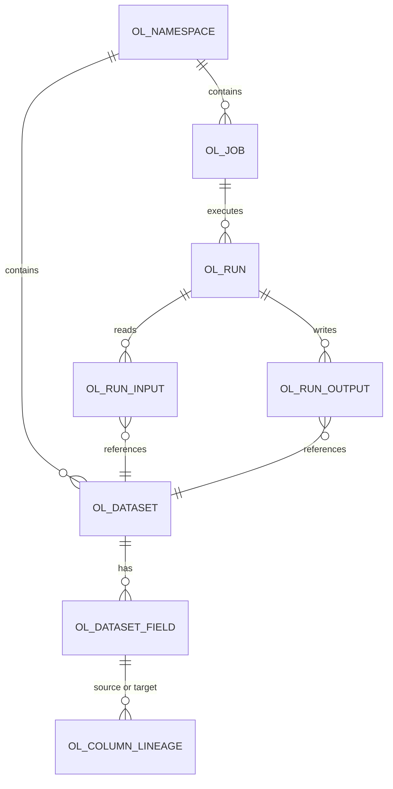

# Phase 27: Developer Manual - Research

**Researched:** 2026-02-08
**Domain:** Documentation / Developer onboarding and contribution documentation
**Confidence:** HIGH

## Summary

This phase creates `docs/developer_manual.md` to enable a new developer to set up a local environment, run all test suites, understand the architecture, and contribute code. Research involved reading every relevant source file across the entire codebase to understand what must be documented and verify the accuracy of all technical details.

The project has extensive raw material distributed across multiple files. `CLAUDE.md` contains the most comprehensive developer reference (architecture, commands, API endpoints, testing). Three coding standards files exist in `specs/` (Go, TypeScript/React, SQL). Component READMEs (`lineage-api/README.md`, `lineage-ui/README.md`, `database/README.md`) document structure and commands. The operations guide (`docs/operations_guide.md`) already covers prerequisites, installation, configuration, and database setup from an ops perspective. The developer manual should NOT duplicate the operations guide; instead it should reference it for environment setup and focus on architecture understanding, testing workflows, code standards, and contribution process.

The project does NOT have a `CONTRIBUTING.md`, `.github/` directory, PR templates, or any documented commit/PR conventions. These conventions must be derived from the existing git history (which uses conventional commits: `type(scope): description`) and codified in the developer manual. There are no CI/CD pipelines, linters in pre-commit hooks, or automated checks -- all quality is enforced manually.

**Primary recommendation:** Create a single `docs/developer_manual.md` file organized into developer lifecycle sections: (1) environment setup (reference ops guide, add dev-specific details), (2) running tests (all 4 suites with expected output), (3) architecture deep-dives (hexagonal backend, React frontend, OpenLineage schema), (4) code standards (summarize-and-link to specs/), (5) contributing guidelines (commit conventions, PR process). Use Mermaid for architecture diagrams. The ROADMAP suggests 3 plans which aligns well with the requirement groupings.

## Standard Stack

This is a documentation-only phase. No libraries are installed.

### Core Tools
| Tool | Purpose | Why Standard |
|------|---------|--------------|
| Markdown | Documentation format | Used throughout project, GitHub renders natively |
| Mermaid | Architecture diagrams | GitHub renders Mermaid natively, already used in root README and ops guide |

### Supporting
| Tool | Purpose | When to Use |
|------|---------|-------------|
| ASCII art | Inline structure diagrams | For directory tree visualizations (already used in CLAUDE.md and READMEs) |

### Alternatives Considered
| Instead of | Could Use | Tradeoff |
|------------|-----------|----------|
| Single dev manual | Multiple docs (CONTRIBUTING.md + ARCHITECTURE.md + TESTING.md) | Single file is easier to discover and follow; TOC provides navigation. Matches pattern from ops guide and user guide. |
| Mermaid diagrams | PNG/SVG images | Mermaid is text-based (diffable, no binary blobs), GitHub renders natively |
| Summarize-and-link to specs/ | Inline all coding standards | Link pattern avoids duplication and content drift; specs/ are the source of truth |

## Architecture Patterns

### Document Structure (Target)
```
docs/
├── developer_manual.md   # PRIMARY TARGET - new file
├── operations_guide.md   # Already exists (referenced for setup, not duplicated)
├── user_guide.md         # Already exists (not in scope)
├── SECURITY.md           # Already exists (not in scope)
└── screenshots/          # Already exists (not relevant)
```

### Pattern: Developer Lifecycle Sections

The dev manual should follow a developer's onboarding journey, from setup through first contribution. Each section answers a specific developer question:

| Section | Developer Question |
|---------|-------------------|
| Quick Start | "How do I get this running on my machine in 10 minutes?" |
| Environment Setup | "What tools do I need and how do I configure them?" |
| Running Tests | "How do I run tests and know they pass?" |
| Architecture Overview | "How is the system structured?" |
| Backend Architecture | "How does the Go backend work (hexagonal pattern)?" |
| Frontend Architecture | "How does the React frontend work (components/stores/hooks)?" |
| Database & Schema | "What's the OpenLineage schema and how does lineage traversal work?" |
| API Reference | "What endpoints exist and how are they versioned?" |
| Code Standards | "What conventions do I follow when writing code?" |
| Commit Conventions | "How do I format commit messages?" |
| Contributing Process | "How do I submit changes for review?" |
| Architecture Diagrams | "Can I see a visual overview?" |

### Pattern: Requirement-to-Section Mapping

Each DEV requirement maps to specific sections of the new dev manual:

| Requirement | Target Section | Source Material |
|-------------|---------------|-----------------|
| DEV-01: Python venv setup | Environment Setup > Python | `CLAUDE.md` Quick Start, `requirements.txt`, `ops_guide` Installation |
| DEV-02: Node.js/npm setup | Environment Setup > Node.js | `CLAUDE.md` Quick Start, `package.json`, `ops_guide` Installation |
| DEV-03: .env configuration | Environment Setup > Configuration | `.env.example`, `config.go`, `db_config.py`, `ops_guide` Configuration |
| DEV-04: Database initialization | Environment Setup > Database | `CLAUDE.md` Quick Start, `database/README.md`, `ops_guide` Database Setup |
| DEV-05: 73 database tests | Running Tests > Database | `database/README.md` Testing, `tests/run_tests.py` |
| DEV-06: 20 API tests | Running Tests > API | `lineage-api/README.md` Testing, `tests/run_api_tests.py` |
| DEV-07: 558 frontend unit tests | Running Tests > Frontend Unit | `lineage-ui/README.md` Testing, `vitest.config.ts` |
| DEV-08: 34 E2E tests | Running Tests > E2E | `lineage-ui/README.md` Testing, `playwright.config.ts` |
| DEV-09: Hexagonal architecture | Backend Architecture > Pattern | `lineage-api/README.md`, `specs/lineage_plan_backend.md` |
| DEV-10: Go backend layers | Backend Architecture > Layers | `lineage-api/README.md`, actual source files in `internal/` |
| DEV-11: React frontend structure | Frontend Architecture | `lineage-ui/README.md`, actual source in `src/` |
| DEV-12: OpenLineage schema + v2 API | Database & Schema + API Reference | `CLAUDE.md` OpenLineage/API, `database/README.md` |
| DEV-13: Code standards | Code Standards | `specs/coding_standards_go.md`, `specs/coding_standards_typescript.md`, `specs/coding_standards_sql.md` |
| DEV-14: Commit conventions | Contributing > Commits | Git history analysis (conventional commits pattern) |
| DEV-15: PR process | Contributing > PR Process | No existing docs -- must be authored based on project practices |
| DEV-16: Architecture diagrams | Architecture Diagrams | New Mermaid diagrams for backend, frontend, database |

### Pattern: Reference-Not-Duplicate

The operations guide already covers environment setup (prerequisites, installation, configuration, database setup) in full detail. The developer manual should:

1. **Provide a quick start** that gets a dev running in minimal steps (more concise than ops guide)
2. **Reference the ops guide** for detailed configuration, QVCI setup, production deployment
3. **Add dev-specific details** that the ops guide omits: IDE setup tips, running in watch mode, debugging, hot reload

This avoids the content duplication problem that was called out as an anti-pattern in Phase 26 research.

### Anti-Patterns to Avoid
- **Duplicating the operations guide:** Reference it for setup details; add only dev-specific context
- **Copying specs/ coding standards in full:** Summarize key conventions and link to specs/ files as canonical source
- **Inventing PR process from thin air:** Document what actually exists (which is currently informal); don't create heavyweight process that nobody follows
- **Stale test counts:** The requirements reference specific numbers (73, 20, 444+, 34). Verify actual counts and use current numbers, not requirement numbers. Actual counts: 73 database, 20 API, 558 frontend unit, 34 E2E.
- **Omitting Python backend:** Both Go and Python backends are first-class. Document both.

## Don't Hand-Roll

Problems that look simple but have existing solutions:

| Problem | Don't Build | Use Instead | Why |
|---------|-------------|-------------|-----|
| Architecture diagrams | Static PNG images | Mermaid in markdown | Diffable, no binary blob, GitHub renders natively |
| Environment setup docs | Write from scratch | Reference `docs/operations_guide.md` | Ops guide has comprehensive, verified setup instructions |
| Code standards docs | Restate all rules | Summarize-and-link to `specs/coding_standards_*.md` | Specs are canonical; summarizing avoids drift |
| Backend structure docs | Describe from memory | Extract from actual `internal/` directory tree | Source code is the truth |
| Frontend structure docs | Describe from memory | Extract from actual `src/` directory tree | Source code is the truth |
| Commit convention docs | Invent conventions | Extract patterns from git history | Existing history shows consistent conventional commits |

**Key insight:** ~70% of the content for this dev manual already exists across `CLAUDE.md`, `docs/operations_guide.md`, `lineage-api/README.md`, `lineage-ui/README.md`, `database/README.md`, and `specs/coding_standards_*.md`. The task is organizing, cross-referencing, filling gaps (commit conventions, PR process, architecture diagrams), and targeting a developer audience.

## Common Pitfalls

### Pitfall 1: Duplicating the Operations Guide
**What goes wrong:** Dev manual restates Python venv setup, .env configuration, QVCI steps, etc. that are already fully documented in the ops guide. Creates maintenance burden and eventual drift.
**Why it happens:** Natural tendency to make the dev manual "complete" and self-contained.
**How to avoid:** Provide a concise "Quick Start" (10 commands to get running), then link to ops guide for detailed setup. Add ONLY dev-specific information: IDE config, watch mode, debug tips.
**Warning signs:** Dev manual has sections that are copy-pastes from ops guide.

### Pitfall 2: Stale Test Counts
**What goes wrong:** Dev manual says "444+ frontend unit tests" (from requirements) but actual count is 558. New developer runs tests, sees 558, and questions doc accuracy.
**Why it happens:** Requirements were written based on counts at time of definition; tests have been added since.
**How to avoid:** Use current verified counts in the dev manual. State approximate counts with "~" or "500+" rather than exact numbers that will drift. Or use phrasings like "Run the full suite (currently 558 tests)."
**Warning signs:** Test count in docs doesn't match `npm test` output.

### Pitfall 3: Missing the Python Backend
**What goes wrong:** Dev manual only documents Go backend testing/architecture, treating Python Flask server as secondary.
**Why it happens:** Go is described as the "production" backend in specs; hexagonal architecture is Go-specific.
**How to avoid:** Document BOTH backends. The Python server is often easier for local dev (no compilation). Clearly state that both serve the same API and are interchangeable.
**Warning signs:** `python python_server.py` not mentioned in dev setup or testing sections.

### Pitfall 4: Over-Documenting Architecture
**What goes wrong:** Dev manual becomes a code walkthrough, describing every file and function.
**Why it happens:** Architecture requirements (DEV-09 through DEV-11) can be interpreted very broadly.
**How to avoid:** Focus on the "why" and "how layers connect" rather than "what each file does." The component READMEs already have file-level documentation. The dev manual should explain the pattern (hexagonal architecture, why layers exist) and link to READMEs for details.
**Warning signs:** Dev manual is 2000+ lines, mostly file descriptions.

### Pitfall 5: Inventing Heavyweight PR Process
**What goes wrong:** Dev manual prescribes a formal PR process (required reviewers, CI gates, branch protection rules) that doesn't match project reality.
**Why it happens:** Temptation to document "ideal" process rather than actual process.
**How to avoid:** The project has no `.github/` directory, no CI pipeline, no branch protection, and no existing `CONTRIBUTING.md`. Document a lightweight process: branch from main, make changes, test locally, commit with conventions, create PR. Keep it honest about what actually exists.
**Warning signs:** References to CI checks that don't exist, required reviewer counts that aren't enforced.

### Pitfall 6: Not Explaining the Dev-Specific Config
**What goes wrong:** Dev manual tells developers to use ops guide for .env config, but ops guide focuses on production values, not dev-friendly defaults.
**Why it happens:** Ops guide is production-oriented.
**How to avoid:** Add a dev-specific section noting: Vite proxies `/api/*` to `localhost:8080` (so no CORS issues in dev), Redis is optional (skip it for local dev), frontend runs on :3000 with hot reload.
**Warning signs:** Developer follows ops guide verbatim and sets up production-grade config for local development.

## Code Examples

### Verified Commit Convention Pattern

From git history analysis (100 most recent commits), the project uses conventional commits:

```
type(scope): description

Where:
- type: feat, fix, docs, test, chore, refactor
- scope: phase number (e.g., "26"), phase-plan (e.g., "26-01"), or omitted
- description: lowercase, imperative mood

Examples from actual git history:
- docs(26): complete operations-guide phase
- docs(26-02): add Troubleshooting section and update README link
- feat(24-01): rewrite root README with v4.0 content
- fix(20-03): accept dataset name OR dataset_id in Go backend service/repo/mock layers
- test(23-01): add Tooltip and ColumnRow hover unit tests (TEST-01)
- chore: complete v4.0 milestone
```

Source: `git log --oneline -100` from the repository.

### Verified Test Suite Commands and Expected Output

**Database Tests (73 tests):**
```bash
cd database
python tests/run_tests.py
# Expected: 73 tests total, 29 skipped in ClearScape Analytics
```

**API Tests (20 tests):**
```bash
cd lineage-api
python tests/run_api_tests.py
# Requires backend running on :8080
```

**Frontend Unit Tests (558 tests):**
```bash
cd lineage-ui
npm test              # Watch mode (default vitest behavior)
npx vitest --run      # Single run
npm run test:coverage # With coverage report
# Expected: 558 tests across 32 test files
```

**E2E Tests (34 tests):**
```bash
cd lineage-ui
npx playwright test           # Headless
npx playwright test --headed  # With visible browser
# Expected: 34 tests in 1 file (e2e/lineage.spec.ts)
# Requires backend running on :8080
# Playwright auto-starts frontend on :5173 via webServer config
```

Source: Direct execution of test suites and reading of `vitest.config.ts`, `playwright.config.ts`, `database/README.md`, `lineage-api/README.md`.

### Verified Backend Hexagonal Architecture

```
lineage-api/internal/
├── domain/                     # CORE LAYER - No external dependencies
│   ├── entities.go             # Database, Table, Column, ColumnLineage,
│   │                           # LineageGraph, OpenLineage* types
│   ├── repository.go           # Repository interfaces (AssetRepository,
│   │                           # LineageRepository, SearchRepository,
│   │                           # CacheRepository, OpenLineageRepository)
│   └── mocks/                  # Mock implementations for testing
│
├── application/                # USE CASE LAYER - Orchestrates domain
│   ├── dto.go                  # Data transfer objects (request/response)
│   ├── asset_service.go        # Asset browsing logic
│   ├── lineage_service.go      # Lineage traversal logic
│   ├── openlineage_service.go  # OpenLineage-aligned operations
│   └── search_service.go       # Search logic
│
├── adapter/                    # ADAPTER LAYER - External integrations
│   ├── inbound/http/           # Chi router, handlers, middleware
│   │   ├── router.go           # Route definitions (v1 + v2 APIs)
│   │   ├── handlers.go         # v1 API handlers
│   │   ├── openlineage_handlers.go  # v2 API handlers
│   │   ├── response.go         # Response helpers
│   │   └── validation.go       # Input validation
│   └── outbound/
│       ├── teradata/           # Teradata repository implementations
│       │   ├── connection.go   # Connection management
│       │   ├── asset_repo.go   # AssetRepository impl
│       │   ├── lineage_repo.go # LineageRepository impl
│       │   ├── openlineage_repo.go  # OpenLineageRepository impl
│       │   └── search_repo.go  # SearchRepository impl
│       └── redis/
│           └── cache.go        # CacheRepository impl (optional)
│
└── infrastructure/             # CROSS-CUTTING CONCERNS
    ├── config/                 # Viper configuration loading
    └── logging/                # slog structured logging
```

Source: Direct directory listing of `/Users/Daniel.Tehan/Code/lineage/lineage-api/internal/`.

### Verified Frontend Architecture

```
lineage-ui/src/
├── api/                        # API LAYER - Server communication
│   ├── client.ts               # Axios HTTP client
│   └── hooks/                  # TanStack Query custom hooks
│       ├── useAssets.ts        # Asset browser data fetching
│       ├── useLineage.ts       # Lineage graph data fetching
│       ├── useOpenLineage.ts   # OpenLineage v2 API hooks
│       └── useSearch.ts        # Search data fetching
│
├── components/                 # COMPONENT LAYER - UI building blocks
│   ├── common/                 # Reusable UI components
│   │   ├── Button.tsx, Input.tsx
│   │   ├── LoadingSpinner.tsx, LoadingProgress.tsx
│   │   ├── Pagination.tsx, Tooltip.tsx
│   │   └── ErrorBoundary.tsx
│   ├── layout/                 # App chrome
│   │   ├── AppShell.tsx, Header.tsx, Sidebar.tsx
│   └── domain/                 # Feature components
│       ├── AssetBrowser/       # Hierarchical navigation
│       ├── LineageGraph/       # Graph visualization (largest)
│       │   ├── LineageGraph.tsx
│       │   ├── TableNode/, ColumnNode.tsx, LineageEdge.tsx
│       │   ├── Toolbar.tsx, DetailPanel.tsx, Legend.tsx
│       │   ├── DetailPanel/ (ColumnsTab, StatisticsTab, DDLTab)
│       │   ├── LineageTableView/
│       │   └── hooks/ (useLineageHighlight, useDatabaseClusters, etc.)
│       ├── ImpactAnalysis/
│       └── Search/
│
├── features/                   # PAGE LAYER - Route-level components
│   ├── ExplorePage.tsx         # Asset browser page
│   ├── LineagePage.tsx         # Single-column lineage
│   ├── DatabaseLineagePage.tsx # Database-scoped lineage
│   ├── AllDatabasesLineagePage.tsx  # Cross-database lineage
│   ├── ImpactPage.tsx          # Impact analysis
│   └── SearchPage.tsx          # Search results
│
├── stores/                     # STATE LAYER - Zustand stores
│   ├── useLineageStore.ts      # Graph state (selection, depth, direction)
│   └── useUIStore.ts           # UI state (sidebar, panels, view mode)
│
├── hooks/                      # SHARED HOOKS
│   └── useLoadingProgress.ts   # Loading stage tracking
│
├── types/                      # TYPE DEFINITIONS
│   └── openlineage.ts          # OpenLineage API types
│
└── utils/graph/                # GRAPH UTILITIES
    ├── layoutEngine.ts         # ELKjs layout integration
    └── openLineageAdapter.ts   # API response to React Flow adapter
```

Source: Direct reading of `/Users/Daniel.Tehan/Code/lineage/lineage-ui/README.md` and directory exploration.

### Verified Coding Standards Files

Three coding standards files exist in `specs/`:

| File | Language | Sections | Lines |
|------|----------|----------|-------|
| `specs/coding_standards_go.md` | Go | Formatting, Naming, Errors, Structure, Testing, Docs, Concurrency, Deps | ~300 |
| `specs/coding_standards_typescript.md` | TypeScript/React | Formatting, Naming, Components, TypeScript, State, API, Testing, Organization | ~300 |
| `specs/coding_standards_sql.md` | Teradata SQL | Naming, Formatting, Performance, PI Design, Indexes, Partitioning, Temp Tables, Types, Locking, Comments, Anti-Patterns | ~300 |

Key conventions from each:

**Go:** `gofmt`/`goimports` on save, 100 char line length, three import groups (stdlib/third-party/internal), errors wrapped with `fmt.Errorf("context: %w", err)`, test files colocated.

**TypeScript:** Prettier + ESLint, PascalCase components, camelCase hooks with `use` prefix, test files as `*.test.tsx`, imports organized in 7 groups.

**SQL:** snake_case for all names, `MULTISET` tables, uppercase SQL keywords, `OL_` prefix for lineage system tables.

Source: Direct reading of all three files.

### Verified OpenLineage Schema

9 tables aligned with OpenLineage spec v2-0-2:

| Table | Purpose | Key Fields |
|-------|---------|------------|
| `OL_NAMESPACE` | Data source namespaces | namespace_id, name (URI: teradata://host:port) |
| `OL_DATASET` | Dataset registry | dataset_id, namespace_id, name (database.table) |
| `OL_DATASET_FIELD` | Field definitions | field_id, dataset_id, name, type |
| `OL_JOB` | Job definitions | job_id, namespace_id, name |
| `OL_RUN` | Job execution runs | run_id, job_id, state |
| `OL_RUN_INPUT` | Run input datasets | run_id, dataset_id |
| `OL_RUN_OUTPUT` | Run output datasets | run_id, dataset_id |
| `OL_COLUMN_LINEAGE` | Column-level lineage | source_field_id, target_field_id, transformation_type |
| `OL_SCHEMA_VERSION` | Schema version tracking | version, applied_at |

Lineage traversal uses recursive CTEs with cycle detection via path tracking.

Source: `CLAUDE.md` OpenLineage section, `database/README.md`, `database/scripts/setup/setup_lineage_schema.py`.

### Architecture Diagram Templates (Mermaid)

**System Architecture (for DEV-16):**


**Backend Hexagonal Architecture (for DEV-16):**


**Database Schema (for DEV-16):**


Source: Synthesized from codebase structure, validated against `CLAUDE.md` architecture section.

## State of the Art

| Old Approach | Current Approach | When Changed | Impact |
|--------------|------------------|--------------|--------|
| No developer docs | CLAUDE.md as de facto dev reference | Always | CLAUDE.md is comprehensive but AI-oriented, not developer-onboarding-oriented |
| No contributing guidelines | Informal process via git history | Always | Commit conventions exist but are undocumented |
| No architecture docs beyond READMEs | Component READMEs (Phase 24) | 2026-02-07 | READMEs document structure but not "why" or patterns |
| `LIN_*` tables | `OL_*` tables (OpenLineage) | v2.0 | Dev manual must document OL_* only; LIN_* is legacy |
| v1 API | v1 + v2 API (OpenLineage-aligned) | v2.0 | Dev manual should focus on v2 API, note v1 exists for backwards compat |

**Deprecated/outdated (do NOT document in dev manual):**
- `LIN_*` tables: Replaced by `OL_*` tables
- `TD_*` env vars: Document `TERADATA_*` as primary with note about `TD_*` fallback
- v1 API as primary: Frontend uses v2 API; v1 exists for backward compatibility only

## Content Gap Analysis

What the dev manual needs that does NOT exist in any current document:

| Gap | What's Needed | How to Fill |
|-----|---------------|-------------|
| Commit message conventions | Formal documentation of conventional commit format | Extract from git history, codify as standard |
| PR process | How to create and submit PRs | Define lightweight process based on project reality (no CI, no branch protection) |
| Architecture "why" | Why hexagonal, why Zustand vs Redux, why ELKjs | Author explanations based on project decisions and specs |
| Dev-specific quick start | Minimal steps to get coding (not ops-oriented) | Distill from ops guide, add dev context (watch mode, hot reload) |
| Test suite explanations | What each suite validates, when to run which | Author based on test plan docs and actual test files |
| Architecture diagrams (Mermaid) | Visual system, backend, frontend, and database diagrams | Create new Mermaid diagrams (templates above) |
| IDE/editor setup tips | VS Code settings for Go and TypeScript | Extract from coding standards (editor config sections) |

## Existing Content Inventory

Detailed inventory of what already exists and where, organized by DEV requirement:

### DEV-01 through DEV-04 (Environment Setup)
- **Ops guide prerequisites:** `docs/operations_guide.md` lines 22-55 (versions, software)
- **Ops guide installation:** `docs/operations_guide.md` lines 56-101 (venv, npm, Go build)
- **Ops guide configuration:** `docs/operations_guide.md` lines 105-168 (env vars, config reference)
- **Ops guide database setup:** `docs/operations_guide.md` lines 170-265 (QVCI, schema, population)
- **Quick start:** `CLAUDE.md` lines 38-58, `README.md` lines 25-69
- **Python deps:** `requirements.txt` (6 packages)
- **Node.js deps:** `lineage-ui/package.json` (13 production, 16 dev)
- **.env template:** `.env.example` (12 variables)
- **Dev-specific:** Vite proxies API to :8080 (`vite.config.ts`), Playwright auto-starts frontend on :5173 (`playwright.config.ts`)

### DEV-05 through DEV-08 (Running Tests)
- **Database tests:** `database/README.md` Testing section (73 tests, 4 test files)
- **API tests:** `lineage-api/README.md` Testing section (20 tests)
- **Frontend unit tests:** `lineage-ui/README.md` Testing section (500+ tests across 32 files, actually 558 currently)
- **E2E tests:** `lineage-ui/README.md` Testing section (34 tests in `e2e/lineage.spec.ts`)
- **Test commands:** `CLAUDE.md` Testing table
- **Vitest config:** `vitest.config.ts` (jsdom environment, setup file, coverage)
- **Playwright config:** `playwright.config.ts` (chromium, baseURL :5173, webServer auto-start)
- **Makefile:** `lineage-api/Makefile` (Go test with race detection + coverage)

### DEV-09 through DEV-11 (Architecture)
- **Backend architecture:** `lineage-api/README.md` Architecture section (directory tree + layer descriptions)
- **Frontend architecture:** `lineage-ui/README.md` Component Structure (directory tree + descriptions)
- **CLAUDE.md architecture:** Lines 92-167 (system diagram, backend/frontend/database structure)
- **Domain entities:** `internal/domain/entities.go` (Database, Table, Column, ColumnLineage, LineageGraph, OpenLineage types)
- **Repository interfaces:** `internal/domain/repository.go` (5 interfaces: Asset, Lineage, Search, Cache, OpenLineage)
- **State management:** `lineage-ui/README.md` State Management section (Zustand stores + TanStack Query)

### DEV-12 (OpenLineage Schema + v2 API)
- **Schema overview:** `CLAUDE.md` OpenLineage Schema section (9 tables)
- **Schema details:** `database/README.md` OpenLineage Schema section
- **API endpoints:** `CLAUDE.md` API Endpoints section (v2 API)
- **API detailed:** `lineage-api/README.md` API Endpoints section (v1 + v2 with full paths)
- **Lineage traversal:** `CLAUDE.md` Lineage Traversal section (recursive CTEs)

### DEV-13 (Code Standards)
- **Go standards:** `specs/coding_standards_go.md` (8 sections)
- **TypeScript standards:** `specs/coding_standards_typescript.md` (8 sections)
- **SQL standards:** `specs/coding_standards_sql.md` (11 sections)

### DEV-14, DEV-15 (Commit/PR Conventions)
- **NO existing documentation** -- this is a GAP
- **Evidence from git history:** 100+ commits using `type(scope): description` pattern
- **Types observed:** `feat`, `fix`, `docs`, `test`, `chore`, `refactor`
- **Scopes observed:** Phase numbers (`26`), plan numbers (`26-01`), or omitted
- **No CONTRIBUTING.md, no .github/, no PR templates**

### DEV-16 (Architecture Diagrams)
- **Root README:** Has Mermaid `graph LR` system architecture (simple)
- **Ops guide:** Has Mermaid `graph TD` deployment architecture (proxy/app/data layers)
- **CLAUDE.md:** Has ASCII art architecture diagram
- **NEW needed:** Detailed backend hexagonal diagram, frontend component hierarchy diagram, database ER diagram

## Recommended Plan Split

The ROADMAP suggests 3 plans. Based on requirement groupings and dependencies:

### Plan 27-01: Environment Setup and Testing Guide
- Create `docs/developer_manual.md` with TOC and header
- Write Quick Start section (condensed 10-command developer setup)
- Write Environment Setup section (reference ops guide, add dev-specific: IDE, watch mode, Vite proxy)
- Write Running Tests section (all 4 suites with commands, expected output, what each validates)
- Requirements covered: DEV-01, DEV-02, DEV-03, DEV-04, DEV-05, DEV-06, DEV-07, DEV-08

### Plan 27-02: Architecture, OpenLineage Schema, and Code Standards
- Write Architecture Overview section (system-level with Mermaid diagram)
- Write Backend Architecture section (hexagonal pattern, Go layers, key interfaces)
- Write Frontend Architecture section (component hierarchy, state management, key patterns)
- Write Database & Schema section (OpenLineage tables, lineage traversal, v2 API overview)
- Write Code Standards section (summarize key rules, link to specs/)
- Requirements covered: DEV-09, DEV-10, DEV-11, DEV-12, DEV-13

### Plan 27-03: Contributing Guidelines and Architecture Diagrams
- Write Commit Conventions section (conventional commits from git history)
- Write PR Process section (branch, test, commit, PR workflow)
- Write/finalize Architecture Diagrams section (backend hexagonal, frontend hierarchy, database ER)
- Update root README to remove "coming in v5.0" annotation from dev manual link
- Requirements covered: DEV-14, DEV-15, DEV-16

## Document Size Estimate

| Section | Estimated Lines | Source |
|---------|----------------|--------|
| Header + TOC | ~30 | New |
| Quick Start | ~50 | Condensed from CLAUDE.md/ops guide |
| Environment Setup | ~80 | Reference ops guide + dev-specific additions |
| Running Tests | ~120 | Consolidate from READMEs + add explanation |
| Architecture Overview | ~40 | New Mermaid diagram + narrative |
| Backend Architecture | ~100 | Consolidate from lineage-api/README.md + explain hexagonal |
| Frontend Architecture | ~100 | Consolidate from lineage-ui/README.md + explain patterns |
| Database & Schema | ~80 | Consolidate from CLAUDE.md + database/README.md |
| API Reference | ~40 | Consolidate from CLAUDE.md API section |
| Code Standards | ~80 | Summarize + link to specs/ |
| Commit Conventions | ~50 | New, extracted from git history |
| PR/Contributing Process | ~50 | New |
| Architecture Diagrams | ~80 | New Mermaid diagrams |
| **Total** | **~900** | Mix of consolidation and new |

## Open Questions

Things that could not be fully resolved:

1. **Frontend test count discrepancy**
   - What we know: Requirements say "444+" but actual count is 558 (525 passing + 33 failing). The README says "500+".
   - What's unclear: Should the dev manual use the current actual count (558) or an approximate like "500+"?
   - Recommendation: Use "500+" as an approximate that won't go stale quickly. Note the exact count in a way that acknowledges it changes: "currently ~558 tests across 32 test files."

2. **33 failing frontend tests**
   - What we know: 33 tests fail (mostly accessibility tests in `accessibility.test.tsx` and some in `LineageGraph.test.tsx`).
   - What's unclear: Should the dev manual mention known failing tests or only document the happy path?
   - Recommendation: Document that some tests may fail due to known issues. This is honest and prevents a new developer from panicking at red test output.

3. **PR review process**
   - What we know: No formal PR process exists (no `.github/`, no branch protection, no CI).
   - What's unclear: Should the dev manual prescribe a formal process or document the lightweight reality?
   - Recommendation: Document a lightweight process that matches reality. Suggest: create branch, make changes, run tests, commit with conventions, create PR with description. Don't prescribe required reviewers or CI gates that don't exist.

4. **Go backend test coverage**
   - What we know: `make test` runs Go tests with race detection, but there's no explicit Go test count in the requirements (DEV-06 covers the Python API tests).
   - What's unclear: Should the dev manual document Go tests as a separate suite?
   - Recommendation: Yes, mention `make test` for Go unit tests alongside the Python API tests. The Go backend has test files (`*_test.go`) in domain, application, and adapter layers.

## Sources

### Primary (HIGH confidence)
- `/Users/Daniel.Tehan/Code/lineage/CLAUDE.md` - Complete project reference (architecture, commands, API, testing, config)
- `/Users/Daniel.Tehan/Code/lineage/README.md` - Root README with quick start and project overview
- `/Users/Daniel.Tehan/Code/lineage/docs/operations_guide.md` - Complete deployment/setup guide (referenced, not duplicated)
- `/Users/Daniel.Tehan/Code/lineage/lineage-api/README.md` - Backend architecture, commands, API endpoints
- `/Users/Daniel.Tehan/Code/lineage/lineage-ui/README.md` - Frontend structure, commands, testing
- `/Users/Daniel.Tehan/Code/lineage/database/README.md` - Schema, population, testing
- `/Users/Daniel.Tehan/Code/lineage/specs/coding_standards_go.md` - Go coding standards
- `/Users/Daniel.Tehan/Code/lineage/specs/coding_standards_typescript.md` - TypeScript/React coding standards
- `/Users/Daniel.Tehan/Code/lineage/specs/coding_standards_sql.md` - SQL coding standards
- `/Users/Daniel.Tehan/Code/lineage/.env.example` - Environment variable reference
- `/Users/Daniel.Tehan/Code/lineage/requirements.txt` - Python dependencies
- `/Users/Daniel.Tehan/Code/lineage/lineage-ui/package.json` - Node.js dependencies and scripts
- `/Users/Daniel.Tehan/Code/lineage/lineage-api/go.mod` - Go 1.23 and dependency versions
- `/Users/Daniel.Tehan/Code/lineage/lineage-api/Makefile` - Build/test/lint commands
- `/Users/Daniel.Tehan/Code/lineage/lineage-ui/vitest.config.ts` - Unit test configuration
- `/Users/Daniel.Tehan/Code/lineage/lineage-ui/playwright.config.ts` - E2E test configuration
- `/Users/Daniel.Tehan/Code/lineage/lineage-ui/vite.config.ts` - Vite dev server proxy config
- `/Users/Daniel.Tehan/Code/lineage/lineage-api/internal/domain/entities.go` - Domain entity definitions
- `/Users/Daniel.Tehan/Code/lineage/lineage-api/internal/domain/repository.go` - Repository interfaces
- `/Users/Daniel.Tehan/Code/lineage/lineage-api/internal/infrastructure/config/config.go` - Configuration loading
- `/Users/Daniel.Tehan/Code/lineage/.planning/ROADMAP.md` - Phase plan split suggestion (3 plans)
- `/Users/Daniel.Tehan/Code/lineage/.planning/REQUIREMENTS.md` - DEV-01 through DEV-16 requirements
- `/Users/Daniel.Tehan/Code/lineage/.planning/PROJECT.md` - Key decisions and validated requirements
- Git history (`git log --oneline -100`) - Commit convention patterns

### Secondary (MEDIUM confidence)
- [Developer Onboarding Documentation Must-Haves](https://www.multiplayer.app/blog/developer-onboarding-documentation/) - Onboarding documentation best practices
- [Developer Onboarding Best Practices](https://document360.com/blog/developer-onboarding-best-practices/) - Developer onboarding structure
- [Improve Team Experience with Developer Onboarding Documentation](https://www.idaszak.com/posts/developer-onboarding-documentation/) - Progressive disclosure pattern for documentation
- Phase 26 (Operations Guide) research pattern - Established summarize-and-link, single-file, Mermaid diagram conventions

### Tertiary (LOW confidence)
- None

## Metadata

**Confidence breakdown:**
- Standard stack: HIGH - Documentation-only phase, no library questions
- Architecture: HIGH - All source files read directly, structures verified from code
- Content inventory: HIGH - Every referenced file was read and verified
- Test counts: HIGH - Verified by running actual test suites (558 frontend, 34 E2E)
- Commit conventions: HIGH - Extracted from 100+ actual git commits
- Architecture diagrams: MEDIUM - Mermaid templates created but will need refinement during implementation
- PR process: MEDIUM - Must be authored (no existing docs); based on project reality observation

**Research date:** 2026-02-08
**Valid until:** 2026-03-08 (stable -- documentation phase with no dependency on external libraries)
