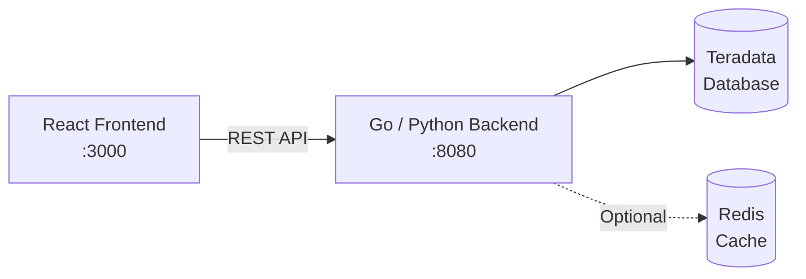

# Teradata Column Lineage

**Status:** v4.0 -- Production Ready

A column-level data lineage application for Teradata databases that visualizes data flow between database columns, enabling impact analysis for change management. Browse database assets, trace column-level dependencies upstream and downstream, and understand the ripple effects of schema or data changes.

## Features

- **Asset Browser** -- Navigate database hierarchies (databases, tables, columns) with pagination (25/50/100/200 items per page)
- **Lineage Graph** -- Interactive column-level lineage visualization with upstream/downstream traversal
- **Detail Panel** -- Inspect table metadata with tabbed Columns/Statistics/DDL views
- **Statistics** -- View row counts, table size, owner, creation and modification dates
- **DDL Viewer** -- View SQL and table definitions with syntax highlighting
- **Impact Analysis** -- Understand downstream effects of schema changes
- **Search** -- Find databases, tables, and columns across your environment
- **Graph Controls** -- Adjustable depth and direction, fit-to-selection viewport, graph export
- **Smooth Animations** -- CSS transitions for highlights, panel slides, and selection changes
- **Loading Progress** -- Five-stage loading indicator with ETA for large graphs
- **Selection Breadcrumb** -- Database > Table > Column hierarchy display

## Quick Start

**Prerequisites:** Python 3.x, Node.js 18+, and Teradata database access.

**1. Clone and setup Python environment**

```bash
git clone <repo-url>
cd lineage
python3 -m venv .venv && source .venv/bin/activate
pip install -r requirements.txt
```

**2. Configure database connection**

```bash
cp .env.example .env
# Edit .env with your Teradata credentials
```

**3. Setup database**

```bash
cd database
python scripts/setup/setup_lineage_schema.py --openlineage
python scripts/setup/setup_test_data.py
```

**4. Populate lineage data**

```bash
python scripts/populate/populate_lineage.py
```

**5. Start backend (Python Flask)**

```bash
cd ../lineage-api
python python_server.py  # Runs on :8080
```

**6. Start frontend (new terminal)**

```bash
cd lineage-ui
npm install && npm run dev  # Runs on :3000
```

Open [http://localhost:3000](http://localhost:3000) to access the application.

## Technology Stack

| Technology | Purpose |
|------------|---------|
| Go 1.23 + Chi Router | Backend API |
| Python 3 + Flask | Alternative backend |
| React 18 + TypeScript | Frontend |
| React Flow (@xyflow/react) | Graph visualization |
| ELKjs | Graph layout engine |
| TanStack Query | Data fetching |
| Zustand | State management |
| Tailwind CSS | Styling |
| Teradata | Database |
| Redis | Cache (optional) |

## Architecture



The frontend makes REST API calls to the backend, which queries Teradata for lineage metadata and optionally caches responses in Redis. The frontend uses React Flow with ELKjs for interactive graph layout and visualization.

## Documentation

| Document | Description |
|----------|-------------|
| [User Guide](docs/user_guide.md) | Application usage and features |
| [Operations Guide](docs/operations_guide.md) | Deployment, configuration, and production hardening |
| [Developer Manual](docs/developer_manual.md) | Architecture, testing, and contributing guidelines |
| [Security Guide](docs/SECURITY.md) | Production security requirements |
| [Specifications](specs/) | Technical specs and test plans |
| [CLAUDE.md](CLAUDE.md) | AI development reference |

## Project Structure

| Directory | Description | Details |
|-----------|-------------|---------|
| [`lineage-api/`](lineage-api/README.md) | Go/Python backend (hexagonal architecture) | REST API, Teradata queries, Redis cache |
| [`lineage-ui/`](lineage-ui/README.md) | React frontend (TypeScript, React Flow) | Asset browser, lineage graph, detail panel |
| [`database/`](database/README.md) | Schema, scripts, and tests (OpenLineage-aligned) | OL_* tables, population scripts, 73 tests |
| `docs/` | User and operations documentation | User guide, security guide |
| `specs/` | Technical specifications and coding standards | Test plans, coding standards |

## Testing

| Suite | Tests | Command |
|-------|-------|---------|
| Database | 73 | `cd database && python tests/run_tests.py` |
| Backend API | 20 | `cd lineage-api && python tests/run_api_tests.py` |
| Frontend Unit | 500+ | `cd lineage-ui && npm test` |
| Frontend E2E | 34 | `cd lineage-ui && npx playwright test` |

## Configuration

The project supports configuration via `.env` file or environment variables. Copy [`.env.example`](.env.example) to `.env` and update with your values.

Key variables:

| Variable | Description | Default |
|----------|-------------|---------|
| `TERADATA_HOST` | Teradata host | -- |
| `TERADATA_USER` | Teradata username | -- |
| `TERADATA_PASSWORD` | Teradata password | -- |
| `TERADATA_DATABASE` | Default database | `demo_user` |
| `API_PORT` | HTTP server port | `8080` |
| `REDIS_ADDR` | Redis address | `localhost:6379` |

Legacy `TD_HOST`, `TD_USER`, `TD_PASSWORD`, and `TD_DATABASE` aliases are still supported as fallbacks.
