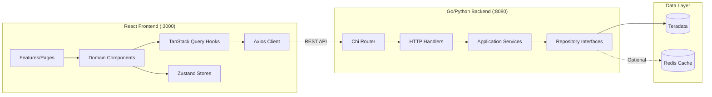
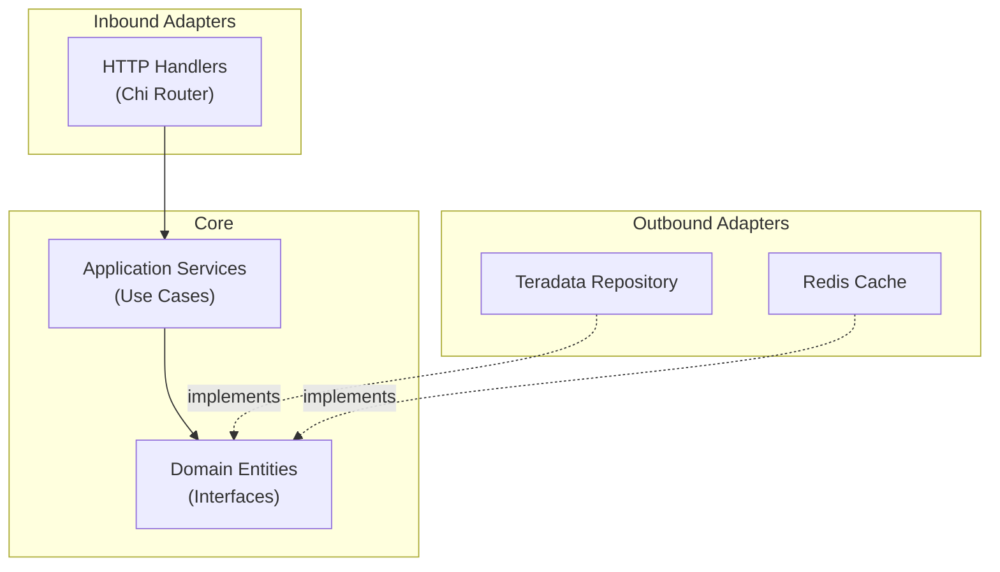
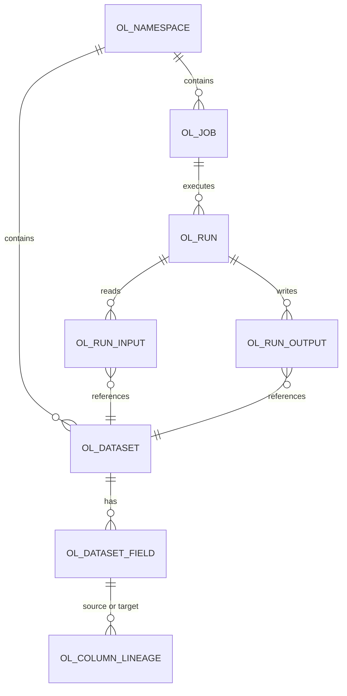

# Developer Manual

This manual enables a new developer to set up a local environment, run all test suites, understand the architecture, and contribute code.

**Related documentation:**
- [Operations Guide](operations_guide.md) -- Deployment, configuration, and production operations
- [User Guide](user_guide.md) -- End-user feature documentation
- [Security Documentation](SECURITY.md) -- TLS, authentication proxy, rate limiting, CORS

## Table of Contents

1. [Quick Start](#quick-start)
2. [Environment Setup](#environment-setup)
3. [Running Tests](#running-tests)
4. [Architecture Overview](#architecture-overview)
5. [Backend Architecture](#backend-architecture)
6. [Frontend Architecture](#frontend-architecture)
7. [Database and Schema](#database-and-schema)
8. [API Reference](#api-reference)
9. [Code Standards](#code-standards)
10. [Contributing](#contributing)

---

## Quick Start

Get the application running locally in under 10 minutes.

```bash
# 1. Clone and enter project
git clone <repository-url>
cd lineage

# 2. Python environment
python3 -m venv .venv
source .venv/bin/activate        # Linux / macOS
# .venv\Scripts\activate         # Windows
pip install -r requirements.txt

# 3. Configure environment
cp .env.example .env
# Edit .env with your Teradata credentials:
#   TERADATA_HOST=your-teradata-host.example.com
#   TERADATA_USER=your_username
#   TERADATA_PASSWORD=your_password

# 4. Database setup
cd database
python scripts/setup/setup_lineage_schema.py
python scripts/setup/setup_test_data.py

# 5. Populate lineage data
python scripts/populate/populate_lineage.py  # DBQL mode (default), use --fixtures for demo/testing

# 6. Start backend (in this terminal)
cd ../lineage-api
python python_server.py          # Runs on :8080

# 7. Start frontend (open a new terminal)
cd lineage-ui
npm install
npm run dev                      # Runs on :3000, proxies API to :8080
```

Open `http://localhost:3000` to view the application.

For detailed configuration, QVCI setup, and production deployment, see the [Operations Guide](operations_guide.md).

---

## Environment Setup

This section provides developer-specific setup details. For comprehensive installation and configuration procedures, see the [Operations Guide](operations_guide.md).

### Prerequisites

See [Operations Guide > Prerequisites](operations_guide.md#prerequisites) for full software requirements and Teradata QVCI verification.

| Software | Minimum Version | Notes |
|----------|----------------|-------|
| Python | 3.9+ | Required for database scripts and Python backend |
| Node.js | 18+ | Required for frontend build and development |
| Go | 1.23+ | Optional -- only needed for the Go backend |
| Redis | 6+ | Optional -- skip for local development; the application falls back gracefully |

### Python Setup

```bash
python3 -m venv .venv
source .venv/bin/activate
pip install -r requirements.txt
```

This installs six packages: `teradatasql` (Teradata driver), `flask` and `flask-cors` (Python backend), `requests` (HTTP client for testing), `python-dotenv` (environment variable loading), and `sqlglot` (SQL parsing for DBQL lineage extraction).

The Python environment is required regardless of which backend you run. The database setup scripts and population tools all use Python.

### Node.js Setup

```bash
cd lineage-ui
npm install
```

This installs both production dependencies (React, React Flow, TanStack Query, Zustand, ELKjs) and development dependencies (Vitest, Playwright, ESLint, TypeScript). The full dependency list is in `lineage-ui/package.json`.

### Configuration

See [Operations Guide > Configuration](operations_guide.md#configuration) for the full environment variable reference.

Developer-specific notes:

- **Vite proxy:** The Vite dev server proxies all `/api/*` requests to `http://localhost:8080` (configured in `lineage-ui/vite.config.ts`). No CORS configuration is needed during local development.
- **Redis is optional:** Skip Redis for local development. Both the Go and Python backends fall back gracefully when Redis is unavailable. Redis is only beneficial for high-traffic production deployments.
- **Frontend ports:** `npm run dev` runs the frontend on `:3000` with hot module replacement -- changes to React components appear instantly without a full page reload. Playwright E2E tests use a separate instance on `:5173` (auto-started by Playwright's `webServer` config).
- **Backend choice:** Both the Python (Flask) and Go backends serve the same API endpoints and are interchangeable. The Python backend (`python python_server.py`) is recommended for local development because it requires no compilation. See [Operations Guide > Prerequisites](operations_guide.md#prerequisites) for a comparison.

### Database Setup

See [Operations Guide > Database Setup](operations_guide.md#database-setup) for QVCI verification, schema creation, and lineage population procedures.

The lineage population script supports two modes:

| Mode | Command | Use Case |
|------|---------|----------|
| Fixtures (default) | `python scripts/populate/populate_lineage.py` | Demo and testing -- uses hardcoded mappings |
| DBQL extraction | `python scripts/populate/populate_lineage.py --dbql` | Production -- extracts lineage from Teradata query logs |

For local development, the fixtures mode provides a complete working dataset without requiring query log history.

---

## Running Tests

The project has four test suites covering database, API, frontend unit, and end-to-end testing. Run all suites before submitting changes.

### Test Suite Overview

| Suite | Tests | Command | Requires |
|-------|-------|---------|----------|
| Database | 73 | `cd database && python tests/run_tests.py` | Teradata connection |
| API | 20 | `cd lineage-api && python tests/run_api_tests.py` | Backend running on :8080 |
| Frontend Unit | ~558 | `cd lineage-ui && npm test` | Nothing (runs in jsdom) |
| E2E | 34 | `cd lineage-ui && npx playwright test` | Backend on :8080 |

### 3.1 Database Tests (73 tests)

**Command:**

```bash
cd database
python tests/run_tests.py
```

**Requires:** Teradata connection (configured via `.env`).

**What it validates:** Schema correctness, CTE lineage traversal (upstream and downstream), cycle detection, diamond patterns, fan-in/fan-out, and performance benchmarks.

**Test files:**
- `tests/run_tests.py` -- Main test runner
- `tests/test_correctness.py` -- CTE correctness validation
- `tests/test_credential_validation.py` -- Credential validation
- `tests/test_dbql_error_handling.py` -- DBQL error handling

**Note:** 29 tests are skipped in ClearScape Analytics environments due to DBQL and index limitations. Expected output is approximately 73 tests total with 29 skipped.

### 3.2 API Tests (20 tests)

**Command:**

```bash
cd lineage-api
python tests/run_api_tests.py
```

**Requires:** The Python backend running on `:8080`. Start it first in a separate terminal:

```bash
cd lineage-api
python python_server.py
```

**What it validates:** All REST API endpoints (v1 and v2), response shapes, error handling, and search functionality.

### 3.3 Frontend Unit Tests (~558 tests)

**Commands:**

```bash
cd lineage-ui

# Watch mode (re-runs on file changes, best for development)
npm test

# Single run (CI-style, exits after completion)
npx vitest --run

# With coverage report
npm run test:coverage
```

**Requires:** Nothing. Tests run in a jsdom environment via Vitest -- no backend or browser needed.

**What it validates:** Component rendering, hook behavior, store logic, API client mocking, graph layout calculations, and accessibility.

**Configuration:** `vitest.config.ts` sets the jsdom environment with a setup file at `src/test/setup.ts`. Coverage uses the v8 provider.

**Note:** The test count changes as tests are added; currently ~558 tests across 32 test files. Some tests may have known failures (accessibility tests). Use watch mode during development for the fastest feedback loop.

### 3.4 E2E Tests (34 tests)

**Commands:**

```bash
cd lineage-ui

# Headless (default)
npx playwright test

# With visible browser
npx playwright test --headed

# Interactive UI mode (inspect tests step by step)
npx playwright test --ui
```

**Requires:** The Python backend running on `:8080`. You do NOT need to run `npm run dev` separately -- Playwright automatically starts the frontend on `:5173` via its `webServer` configuration.

**What it validates:** Full user workflows including asset browsing, lineage graph navigation, search, and detail panel interaction.

**Test file:** `e2e/lineage.spec.ts` (single file with 34 tests).

**Configuration:** `playwright.config.ts` runs Chromium only, with `baseURL` set to `http://localhost:5173`. The `webServer` block starts `npm run dev -- --port 5173` automatically.

**First-time setup:** Download browser binaries before your first run:

```bash
npx playwright install
```

### 3.5 Go Backend Tests (optional)

**Command:**

```bash
cd lineage-api
make test
```

**What it validates:** Go unit tests with race detection and coverage. Tests are colocated with source files (`*_test.go`) across the domain, application, and adapter layers.

**Note:** These test the Go backend independently from the Python API tests. Most local development uses the Python backend, so these are optional unless you are modifying Go code.

### Testing Guidance

For day-to-day development, frontend unit tests (`npm test` in watch mode) provide the fastest feedback. Run the full suite across all four test types before committing changes.

---

## Architecture Overview

The application follows a three-tier architecture: React frontend, Go/Python backend, and Teradata database with optional Redis caching.



**How the tiers connect:**

- **Frontend to backend:** The React frontend communicates with the backend exclusively through REST API calls. During local development, Vite proxies all `/api/*` requests to `localhost:8080`, so no CORS configuration is needed.
- **Two backend implementations:** The Go backend (Chi router, hexagonal architecture) is the production implementation. The Python Flask backend (`python_server.py`) serves identical API endpoints with a simpler architecture. Both are interchangeable -- the frontend does not know which backend is running.
- **Data layer:** Teradata stores all lineage metadata in `OL_*` tables. Redis provides an optional caching layer; the application falls back gracefully without it and Redis is only beneficial for high-traffic deployments.

---

## Backend Architecture

### 5.1 Hexagonal Architecture Pattern

The Go backend uses hexagonal (ports and adapters) architecture. The core idea: the domain layer defines interfaces (ports) with no external dependencies, and adapters implement those interfaces for specific technologies. This means the core business logic can be tested without a Teradata connection or Redis instance.



**Why hexagonal?** Dependency inversion keeps the domain pure. Services depend on interfaces, not concrete database code. When testing, mock implementations replace real adapters. When switching databases or caches, only the adapter layer changes.

### 5.2 Directory Structure

```
lineage-api/internal/
├── domain/                     # CORE LAYER - No external dependencies
│   ├── entities.go             # Database, Table, Column, ColumnLineage,
│   │                           # LineageGraph, OpenLineage* types
│   ├── repository.go           # Repository interfaces (AssetRepository,
│   │                           # LineageRepository, SearchRepository,
│   │                           # CacheRepository, OpenLineageRepository)
│   └── mocks/                  # Mock implementations for testing
│
├── application/                # USE CASE LAYER - Orchestrates domain
│   ├── dto.go                  # Data transfer objects (request/response)
│   ├── asset_service.go        # Asset browsing logic
│   ├── lineage_service.go      # Lineage traversal logic
│   ├── openlineage_service.go  # OpenLineage-aligned operations
│   └── search_service.go       # Search logic
│
├── adapter/                    # ADAPTER LAYER - External integrations
│   ├── inbound/http/           # Chi router, handlers, middleware
│   │   ├── router.go           # Route definitions (v1 + v2 APIs)
│   │   ├── handlers.go         # v1 API handlers
│   │   ├── openlineage_handlers.go  # v2 API handlers
│   │   ├── cache_middleware.go  # Cache control and headers middleware
│   │   ├── response.go         # Response helpers
│   │   └── validation.go       # Input validation
│   └── outbound/
│       ├── teradata/           # Teradata repository implementations
│       │   ├── connection.go   # Connection management
│       │   ├── asset_repo.go   # AssetRepository impl
│       │   ├── lineage_repo.go # LineageRepository impl
│       │   ├── openlineage_repo.go  # OpenLineageRepository impl
│       │   └── search_repo.go  # SearchRepository impl
│       └── redis/
│           ├── cache.go                    # CacheRepository interface, NoOpCache, CacheTTLConfig
│           ├── cache_keys.go               # Deterministic cache key builder functions
│           ├── cache_keys_test.go          # Cache key builder tests
│           ├── cache_metadata.go           # CacheMetadata context type, bypass signal
│           ├── cache_test.go               # CacheRepository unit tests
│           ├── cached_openlineage_repo.go  # CachedOpenLineageRepository decorator
│           └── cached_openlineage_repo_test.go  # Decorator unit tests
│
└── infrastructure/             # CROSS-CUTTING CONCERNS
    ├── config/                 # Viper configuration loading
    └── logging/                # slog structured logging
```

**Layer responsibilities:**

- **domain/** -- Core entities (`Database`, `Table`, `Column`, `ColumnLineage`, `LineageGraph`, and all `OpenLineage*` types) and repository interfaces. This layer has zero external imports beyond the Go standard library.
- **application/** -- Service layer implementing use cases. DTOs define the shapes of API requests and responses. Services orchestrate domain operations and enforce business rules.
- **adapter/inbound/http/** -- Chi router, HTTP handlers for both v1 and v2 APIs, middleware, input validation, and response helpers. This is the only layer that knows about HTTP.
- **adapter/outbound/teradata/** -- Teradata repository implementations. Contains SQL queries, connection management, and result mapping. This is the only layer that knows about Teradata.
- **adapter/outbound/redis/** -- Redis caching layer using the cache-aside (read-through) pattern. `CachedOpenLineageRepository` is a decorator that wraps the Teradata repository, checking Redis before querying Teradata and populating Redis after a cache miss. Includes deterministic cache key builders, per-data-type TTL configuration, context-based cache metadata propagation, and a `NoOpCache` fallback for when Redis is unavailable. Cache status is communicated to the HTTP layer via request context, where `CacheControl` middleware sets `X-Cache` and `X-Cache-TTL` response headers.
- **infrastructure/** -- Cross-cutting concerns: Viper-based configuration loading and slog structured logging.

### 5.3 Key Interfaces

The domain layer defines five repository interfaces in `domain/repository.go`:

| Interface | Purpose | Key Methods |
|-----------|---------|-------------|
| `AssetRepository` | Browse databases, tables, columns | `ListDatabases`, `GetTable`, `ListColumns` |
| `LineageRepository` | Traverse lineage graph | `GetUpstreamLineage`, `GetDownstreamLineage` |
| `SearchRepository` | Search across datasets | `Search` (with asset type filters) |
| `CacheRepository` | Optional caching layer | `Get`, `Set`, `Delete`, `Exists`, `TTL` |
| `OpenLineageRepository` | OpenLineage-aligned operations | `GetColumnLineageGraph`, `ListDatasets`, `ListFields` |

Mock implementations in `domain/mocks/` enable testing services without a Teradata connection.

### 5.4 Python Backend

The Python Flask backend (`lineage-api/python_server.py`) serves the same API endpoints without the hexagonal architecture. It queries Teradata directly using `teradatasql` and returns JSON responses via Flask. This simpler implementation is recommended for local development because it requires no Go compilation and starts instantly.

Both backends are interchangeable. The frontend works identically with either one.

---

## Frontend Architecture

### 6.1 Technology Stack

| Technology | Purpose |
|-----------|---------|
| React 18 | UI framework |
| TypeScript | Type safety |
| Vite | Build tool and dev server |
| TanStack Query | Server state management (caching, refetching, loading) |
| Zustand | Client state management (UI state, selections) |
| React Flow (@xyflow/react) | Graph visualization |
| ELKjs | Automatic hierarchical graph layout |

### 6.2 Directory Structure

```
lineage-ui/src/
├── api/                        # API LAYER - Server communication
│   ├── client.ts               # Axios HTTP client
│   └── hooks/                  # TanStack Query custom hooks
│       ├── useAssets.ts        # Asset browser data fetching
│       ├── useLineage.ts       # Lineage graph data fetching
│       ├── useOpenLineage.ts   # OpenLineage v2 API hooks
│       └── useSearch.ts        # Search data fetching
│
├── components/                 # COMPONENT LAYER - UI building blocks
│   ├── common/                 # Reusable UI components
│   │   ├── Button.tsx, Input.tsx
│   │   ├── LoadingSpinner.tsx, LoadingProgress.tsx
│   │   ├── Pagination.tsx, Tooltip.tsx
│   │   └── ErrorBoundary.tsx
│   ├── layout/                 # App chrome
│   │   └── AppShell.tsx, Header.tsx, Sidebar.tsx
│   └── domain/                 # Feature components
│       ├── AssetBrowser/       # Hierarchical database/table/column navigation
│       ├── LineageGraph/       # Graph visualization (largest component group)
│       │   ├── LineageGraph.tsx
│       │   ├── TableNode/, ColumnNode.tsx, LineageEdge.tsx
│       │   ├── Toolbar.tsx, DetailPanel.tsx, Legend.tsx
│       │   ├── DetailPanel/ (ColumnsTab, StatisticsTab, DDLTab)
│       │   ├── LineageTableView/
│       │   └── hooks/ (useLineageHighlight, useDatabaseClusters, etc.)
│       ├── ImpactAnalysis/     # Impact summary and analysis table
│       └── Search/             # SearchBar, SearchResults
│
├── features/                   # PAGE LAYER - Route-level components
│   ├── ExplorePage.tsx         # Asset browser page
│   ├── LineagePage.tsx         # Single-column lineage
│   ├── DatabaseLineagePage.tsx # Database-scoped lineage
│   ├── AllDatabasesLineagePage.tsx  # Cross-database lineage
│   ├── ImpactPage.tsx          # Impact analysis
│   └── SearchPage.tsx          # Search results
│
├── stores/                     # STATE LAYER - Zustand stores
│   ├── useLineageStore.ts      # Graph state (selection, depth, direction)
│   └── useUIStore.ts           # UI state (sidebar, panels, view mode)
│
├── hooks/                      # SHARED HOOKS
│   └── useLoadingProgress.ts   # Loading stage tracking
│
├── types/                      # TYPE DEFINITIONS
│   └── openlineage.ts          # OpenLineage API types
│
└── utils/graph/                # GRAPH UTILITIES
    ├── layoutEngine.ts         # ELKjs layout integration
    └── openLineageAdapter.ts   # API response to React Flow adapter
```

### 6.3 Data Flow

Data flows through the frontend in a consistent pattern:

1. **User navigates** to a page (`features/` component bound to a route)
2. **Page calls a hook** from `api/hooks/` (e.g., `useOpenLineage` for lineage data)
3. **Hook fetches data** from the backend via the Axios client (`api/client.ts`)
4. **Response is transformed** by the adapter (`utils/graph/openLineageAdapter.ts`) into React Flow nodes and edges
5. **Graph components render** using React Flow with custom `TableNode` and `ColumnNode` components
6. **Client-side state** (current selection, depth, direction, sidebar visibility) is managed by Zustand stores

### 6.4 Key Patterns

- **TanStack Query for all server data.** Every API call goes through a TanStack Query hook, which provides automatic caching, background refetching, loading states, and error handling. Components never call the API directly.
- **Zustand for client-only state.** UI state (sidebar open/closed, selected node, graph depth/direction) lives in Zustand stores. These stores have no server sync -- they are purely client-side.
- **React Flow custom nodes.** The lineage graph renders tables as `TableNode` components containing `ColumnNode` children. Each column row is interactive (click to view lineage, hover to highlight).
- **ELKjs for automatic layout.** Graph layout is computed by ELKjs using a hierarchical/layered algorithm. The layout engine runs in `utils/graph/layoutEngine.ts` and positions nodes before React Flow renders them.

---

## Database and Schema

### 7.1 OpenLineage Alignment

The database schema follows the [OpenLineage spec v2-0-2](https://openlineage.io/docs/spec/object-model). All lineage metadata tables use the `OL_` prefix and are stored in the `demo_user` database (configurable via `TERADATA_DATABASE`).



### 7.2 Table Reference

| Table | Purpose | Key Fields |
|-------|---------|------------|
| `OL_NAMESPACE` | Data source namespaces | `namespace_id`, `name` (URI: `teradata://host:port`) |
| `OL_DATASET` | Dataset registry (tables/views) | `dataset_id`, `namespace_id`, `name` (`database.table`) |
| `OL_DATASET_FIELD` | Field definitions (columns) | `field_id`, `dataset_id`, `name`, `type` |
| `OL_JOB` | Job definitions (ETL processes) | `job_id`, `namespace_id`, `name` |
| `OL_RUN` | Job execution runs | `run_id`, `job_id`, `state` |
| `OL_RUN_INPUT` | Run input datasets | `run_id`, `dataset_id` |
| `OL_RUN_OUTPUT` | Run output datasets | `run_id`, `dataset_id` |
| `OL_COLUMN_LINEAGE` | Column-level lineage | `source_field_id`, `target_field_id`, `transformation_type` |
| `OL_SCHEMA_VERSION` | Schema version tracking | `version`, `applied_at` |

### 7.3 Lineage Traversal

Column-level lineage is stored in `OL_COLUMN_LINEAGE`, where each row represents a relationship from a source field to a target field. The backend traverses this graph using recursive CTEs in Teradata:

- **Upstream traversal:** Follows the chain `target_field_id` -> `source_field_id` to find all columns that feed into a given column (answering "where does this data come from?").
- **Downstream traversal:** Follows the chain `source_field_id` -> `target_field_id` to find all columns that depend on a given column (answering "what does this data affect?").
- **Cycle detection:** The recursive CTE tracks the traversal path. If a column appears again in the path, the recursion stops for that branch, preventing infinite loops.
- **Depth control:** A `maxDepth` parameter limits how many levels the CTE traverses (default: 3).

### 7.4 Lineage Population

Lineage data is populated into the `OL_*` tables using `database/scripts/populate/populate_lineage.py`, which supports two modes:

- **Fixtures mode (default):** Uses hardcoded column mappings for demo and testing. Provides a complete working dataset without requiring query log history.
- **DBQL mode (`--dbql`):** Extracts lineage from executed SQL statements in Teradata's query logs (DBC.DBQLSqlTbl). Used for production environments with real query activity.

See [database/README.md](../database/README.md) for detailed population procedures and options.

---

## API Reference

### 8.1 API Versioning

The backend serves two API versions:

- **v1 API:** Original endpoints. Still available for backward compatibility.
- **v2 API:** OpenLineage-aligned endpoints. Used by the frontend and recommended for all new integrations.

### 8.2 v2 Endpoints

| Method | Endpoint | Description |
|--------|----------|-------------|
| GET | `/api/v2/openlineage/namespaces` | List all namespaces |
| GET | `/api/v2/openlineage/namespaces/{namespaceId}` | Get namespace details |
| GET | `/api/v2/openlineage/namespaces/{namespaceId}/datasets` | List datasets in namespace |
| GET | `/api/v2/openlineage/datasets/{datasetId}` | Get dataset with fields |
| GET | `/api/v2/openlineage/datasets/search?q=query` | Search datasets by name |
| GET | `/api/v2/openlineage/lineage/{datasetId}/{fieldName}` | Get lineage graph for a column |

All endpoints return JSON. Error responses use standard HTTP status codes with a JSON body containing an `error` field.

See [lineage-api/README.md](../lineage-api/README.md) for complete endpoint documentation including request/response examples and v1 endpoints.

---

## Code Standards

The project maintains coding standards for all three languages. Full standards are documented in the `specs/` directory; this section summarizes key conventions.

### 9.1 Go Standards

| Convention | Rule |
|-----------|------|
| Formatting | `gofmt`/`goimports` on save |
| Line length | 100 characters |
| Imports | Three groups: stdlib, third-party, internal |
| Errors | Wrap with `fmt.Errorf("context: %w", err)` |
| Test files | Colocated with source (`*_test.go`) |
| Naming | Exported = `PascalCase`, unexported = `camelCase` |

Full standards: [specs/coding_standards_go.md](../specs/coding_standards_go.md)

### 9.2 TypeScript/React Standards

| Convention | Rule |
|-----------|------|
| Formatting | Prettier + ESLint |
| Components | PascalCase, functional with hooks |
| Hooks | camelCase with `use` prefix |
| Test files | `*.test.tsx` colocated with source |
| Imports | 7 groups (React, external, internal, components, hooks, stores, types) |
| State | TanStack Query for server state, Zustand for client state |

Full standards: [specs/coding_standards_typescript.md](../specs/coding_standards_typescript.md)

### 9.3 SQL Standards

| Convention | Rule |
|-----------|------|
| Naming | `snake_case` for all identifiers |
| Keywords | `UPPERCASE` for all SQL keywords |
| Tables | `MULTISET` tables, `OL_` prefix for lineage system tables |
| Formatting | One clause per line, consistent indentation |
| Performance | Use `MULTISET` over `SET` tables, qualify all column references |

Full standards: [specs/coding_standards_sql.md](../specs/coding_standards_sql.md)

---

## Contributing

### 10.1 Development Workflow

The standard development cycle for contributing changes:

1. **Branch** from `main` with a descriptive name (see Section 10.3)
2. **Develop** your changes following the code standards in Section 9
3. **Test** locally by running the relevant test suites (see Section 3)
4. **Commit** with conventional commit messages (see Section 10.2)
5. **Push** and create a pull request (see Section 10.3)

### 10.2 Commit Conventions

This project uses [Conventional Commits](https://www.conventionalcommits.org/). Every commit message follows the format:

```
type(scope): description
```

**Types:**

| Type | When to Use | Example |
|------|-------------|---------|
| `feat` | New feature or functionality | `feat(api): add dataset search endpoint` |
| `fix` | Bug fix | `fix(graph): correct edge routing for self-referencing tables` |
| `docs` | Documentation changes | `docs(readme): update quick start commands` |
| `test` | Adding or updating tests | `test(api): add lineage traversal test cases` |
| `refactor` | Code restructuring (no behavior change) | `refactor(store): simplify lineage state management` |
| `chore` | Maintenance, dependencies, config | `chore: update Node.js dependencies` |

**Scope conventions:**

- Use the component or area affected: `api`, `ui`, `graph`, `database`, `store`, `readme`
- Phase numbers are used during planned development: `feat(24-01): add component READMEs`
- Scope is optional for broad changes: `chore: update dependencies`

**Rules:**

- Write the description in lowercase, imperative mood ("add feature" not "added feature" or "adds feature")
- No period at the end of the subject line
- Keep the first line under 72 characters
- Add a body for complex changes (blank line after the subject line):

```
feat(graph): add database cluster grouping

Group tables by database in the lineage graph using ELKjs
compound nodes. Clusters are collapsible and color-coded.
```

### 10.3 Pull Request Process

1. **Branch:** Create a descriptive branch from `main`
   - Feature: `feature/search-pagination`
   - Bug fix: `fix/graph-edge-routing`
   - Documentation: `docs/update-api-reference`

2. **Develop:** Make changes and commit incrementally with conventional commits

3. **Test:** Run all affected test suites locally before pushing. At minimum:
   - Frontend changes: `npm test` (unit) and `npx playwright test` (E2E)
   - Backend changes: `cd lineage-api && python tests/run_api_tests.py`
   - Database changes: `cd database && python tests/run_tests.py`

4. **Push:** Push your branch to the remote

5. **Create PR:** Open a pull request against `main` with:
   - A clear title following commit convention format (e.g., `feat(graph): add column search within graph`)
   - Description of what changed and why
   - List of test suites you ran

> **Note:** This project does not currently have CI/CD pipelines or branch protection rules. All quality assurance is done through local testing and code review.

### 10.4 Project Structure Reference

When making changes, use this table to find the relevant code:

| What You're Changing | Where to Look |
|---------------------|---------------|
| API endpoint | `lineage-api/internal/adapter/inbound/http/` (Go) or `lineage-api/python_server.py` (Python) |
| Database query | `lineage-api/internal/adapter/outbound/teradata/` |
| UI component | `lineage-ui/src/components/domain/` |
| Graph behavior | `lineage-ui/src/components/domain/LineageGraph/` |
| State management | `lineage-ui/src/stores/` |
| API hook | `lineage-ui/src/api/hooks/` |
| Database schema | `database/scripts/setup/setup_lineage_schema.py` |
| Lineage data | `database/scripts/populate/populate_lineage.py` |
| Coding standards | `specs/coding_standards_*.md` |
