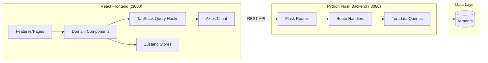

# Developer Manual

This manual enables a new developer to set up a local environment, run all test suites, understand the architecture, and contribute code.

**Related documentation:**
- [Operations Guide](operations_guide.md) -- Deployment, configuration, and production operations
- [User Guide](user_guide.md) -- End-user feature documentation
- [Security Documentation](SECURITY.md) -- TLS, authentication proxy, rate limiting, CORS

## Table of Contents

1. [Quick Start](#quick-start)
2. [Environment Setup](#environment-setup)
3. [Running Tests](#running-tests)
4. [Architecture Overview](#architecture-overview)
5. [Backend Architecture](#backend-architecture)
6. [Frontend Architecture](#frontend-architecture)
7. [Database and Schema](#database-and-schema)
8. [API Reference](#api-reference)
9. [Code Standards](#code-standards)
10. [Contributing](#contributing)

---

## Quick Start

Get the application running locally in under 10 minutes.

```bash
# 1. Clone and enter project
git clone <repository-url>
cd lineage

# 2. Python environment
python3 -m venv .venv
source .venv/bin/activate        # Linux / macOS
# .venv\Scripts\activate         # Windows
pip install -r requirements.txt

# 3. Configure environment
cp .env.example .env
# Edit .env with your Teradata credentials:
#   TERADATA_HOST=your-teradata-host.example.com
#   TERADATA_USER=your_username
#   TERADATA_PASSWORD=your_password

# 4. Database setup
cd database
python scripts/setup/setup_lineage_schema.py
python scripts/setup/setup_test_data.py

# 5. Populate lineage data
python scripts/populate/populate_lineage.py  # DBQL mode (default), use --fixtures for demo/testing

# 6. Start backend (in this terminal)
cd ../lineage-api
python python_server.py          # Runs on :8080

# 7. Start frontend (open a new terminal)
cd lineage-ui
npm install
npm run dev                      # Runs on :3000, proxies API to :8080
```

Open `http://localhost:3000` to view the application.

For detailed configuration, QVCI setup, and production deployment, see the [Operations Guide](operations_guide.md).

---

## Environment Setup

This section provides developer-specific setup details. For comprehensive installation and configuration procedures, see the [Operations Guide](operations_guide.md).

### Prerequisites

See [Operations Guide > Prerequisites](operations_guide.md#prerequisites) for full software requirements and Teradata QVCI verification.

| Software | Minimum Version | Notes |
|----------|----------------|-------|
| Python | 3.9+ | Required for database scripts and backend |
| Node.js | 18+ | Required for frontend build and development |

### Python Setup

```bash
python3 -m venv .venv
source .venv/bin/activate
pip install -r requirements.txt
```

This installs six packages: `teradatasql` (Teradata driver), `flask` and `flask-cors` (Python backend), `requests` (HTTP client for testing), `python-dotenv` (environment variable loading), and `sqlglot` (SQL parsing for DBQL lineage extraction).

The Python environment is required for both the backend server and the database setup scripts.

### Node.js Setup

```bash
cd lineage-ui
npm install
```

This installs both production dependencies (React, React Flow, TanStack Query, Zustand, ELKjs) and development dependencies (Vitest, Playwright, ESLint, TypeScript). The full dependency list is in `lineage-ui/package.json`.

### Configuration

See [Operations Guide > Configuration](operations_guide.md#configuration) for the full environment variable reference.

Developer-specific notes:

- **Vite proxy:** The Vite dev server proxies all `/api/*` requests to `http://localhost:8080` (configured in `lineage-ui/vite.config.ts`). No CORS configuration is needed during local development.
- **Frontend ports:** `npm run dev` runs the frontend on `:3000` with hot module replacement -- changes to React components appear instantly without a full page reload. Playwright E2E tests use a separate instance on `:5173` (auto-started by Playwright's `webServer` config).

### Database Setup

See [Operations Guide > Database Setup](operations_guide.md#database-setup) for QVCI verification, schema creation, and lineage population procedures.

The lineage population script supports two modes:

| Mode | Command | Use Case |
|------|---------|----------|
| Fixtures (default) | `python scripts/populate/populate_lineage.py` | Demo and testing -- uses hardcoded mappings |
| DBQL extraction | `python scripts/populate/populate_lineage.py --dbql` | Production -- extracts lineage from Teradata query logs |

For local development, the fixtures mode provides a complete working dataset without requiring query log history.

---

## Running Tests

The project has four test suites covering database, API, frontend unit, and end-to-end testing. Run all suites before submitting changes.

### Test Suite Overview

| Suite | Tests | Command | Requires |
|-------|-------|---------|----------|
| Database | 73 | `cd database && python tests/run_tests.py` | Teradata connection |
| API | 20 | `cd lineage-api && python tests/run_api_tests.py` | Backend running on :8080 |
| Frontend Unit | ~558 | `cd lineage-ui && npm test` | Nothing (runs in jsdom) |
| E2E | 34 | `cd lineage-ui && npx playwright test` | Backend on :8080 |

### 3.1 Database Tests (73 tests)

**Command:**

```bash
cd database
python tests/run_tests.py
```

**Requires:** Teradata connection (configured via `.env`).

**What it validates:** Schema correctness, CTE lineage traversal (upstream and downstream), cycle detection, diamond patterns, fan-in/fan-out, and performance benchmarks.

**Test files:**
- `tests/run_tests.py` -- Main test runner
- `tests/test_correctness.py` -- CTE correctness validation
- `tests/test_credential_validation.py` -- Credential validation
- `tests/test_dbql_error_handling.py` -- DBQL error handling

**Note:** 29 tests are skipped in ClearScape Analytics environments due to DBQL and index limitations. Expected output is approximately 73 tests total with 29 skipped.

### 3.2 API Tests (20 tests)

**Command:**

```bash
cd lineage-api
python tests/run_api_tests.py
```

**Requires:** The Python backend running on `:8080`. Start it first in a separate terminal:

```bash
cd lineage-api
python python_server.py
```

**What it validates:** All REST API endpoints (v1 and v2), response shapes, error handling, and search functionality.

### 3.3 Frontend Unit Tests (~558 tests)

**Commands:**

```bash
cd lineage-ui

# Watch mode (re-runs on file changes, best for development)
npm test

# Single run (CI-style, exits after completion)
npx vitest --run

# With coverage report
npm run test:coverage
```

**Requires:** Nothing. Tests run in a jsdom environment via Vitest -- no backend or browser needed.

**What it validates:** Component rendering, hook behavior, store logic, API client mocking, graph layout calculations, and accessibility.

**Configuration:** `vitest.config.ts` sets the jsdom environment with a setup file at `src/test/setup.ts`. Coverage uses the v8 provider.

**Note:** The test count changes as tests are added; currently ~558 tests across 32 test files. Some tests may have known failures (accessibility tests). Use watch mode during development for the fastest feedback loop.

### 3.4 E2E Tests (34 tests)

**Commands:**

```bash
cd lineage-ui

# Headless (default)
npx playwright test

# With visible browser
npx playwright test --headed

# Interactive UI mode (inspect tests step by step)
npx playwright test --ui
```

**Requires:** The Python backend running on `:8080`. You do NOT need to run `npm run dev` separately -- Playwright automatically starts the frontend on `:5173` via its `webServer` configuration.

**What it validates:** Full user workflows including asset browsing, lineage graph navigation, search, and detail panel interaction.

**Test file:** `e2e/lineage.spec.ts` (single file with 34 tests).

**Configuration:** `playwright.config.ts` runs Chromium only, with `baseURL` set to `http://localhost:5173`. The `webServer` block starts `npm run dev -- --port 5173` automatically.

**First-time setup:** Download browser binaries before your first run:

```bash
npx playwright install
```

### Testing Guidance

For day-to-day development, frontend unit tests (`npm test` in watch mode) provide the fastest feedback. Run the full suite across all four test types before committing changes.

---

## Architecture Overview

The application follows a three-tier architecture: React frontend, Python Flask backend, and Teradata database.



**How the tiers connect:**

- **Frontend to backend:** The React frontend communicates with the backend exclusively through REST API calls. During local development, Vite proxies all `/api/*` requests to `localhost:8080`, so no CORS configuration is needed.
- **Backend:** The Python Flask backend (`python_server.py`) serves all API endpoints as a single-file application. It queries Teradata directly using the `teradatasql` driver and returns JSON responses.
- **Data layer:** Teradata stores all lineage metadata in `OL_*` tables.

---

## Backend Architecture

### 5.1 Python Flask Backend

The backend is a single-file Flask application (`lineage-api/python_server.py`) that implements all API endpoints. It queries Teradata directly using the `teradatasql` driver.

```
lineage-api/
├── python_server.py               # Flask server with all API endpoints
├── README.md                      # Backend documentation
└── tests/
    └── run_api_tests.py           # 20 API integration tests
```

**Key characteristics:**

- Single-file architecture -- all routes, queries, and response formatting in one file
- Direct Teradata queries using `teradatasql` driver
- CORS configured for localhost development (ports 3000 and 5173)
- Environment variables loaded from `../.env` via `python-dotenv`
- Implements both v1 and v2 API endpoints

### 5.2 Key Patterns

- **Connection per request:** Each API call creates a fresh Teradata connection and closes it after the response is sent
- **Recursive CTEs:** Lineage traversal uses recursive common table expressions in Teradata SQL
- **OpenLineage alignment:** v2 API endpoints follow the OpenLineage spec for namespaces, datasets, and fields

---

## Frontend Architecture

### 6.1 Technology Stack

| Technology | Purpose |
|-----------|---------|
| React 18 | UI framework |
| TypeScript | Type safety |
| Vite | Build tool and dev server |
| TanStack Query | Server state management (caching, refetching, loading) |
| Zustand | Client state management (UI state, selections) |
| React Flow (@xyflow/react) | Graph visualization |
| ELKjs | Automatic hierarchical graph layout |

### 6.2 Directory Structure

```
lineage-ui/src/
├── api/                        # API LAYER - Server communication
│   ├── client.ts               # Axios HTTP client
│   └── hooks/                  # TanStack Query custom hooks
│       ├── useAssets.ts        # Asset browser data fetching
│       ├── useLineage.ts       # Lineage graph data fetching
│       ├── useOpenLineage.ts   # OpenLineage v2 API hooks
│       └── useSearch.ts        # Search data fetching
│
├── components/                 # COMPONENT LAYER - UI building blocks
│   ├── common/                 # Reusable UI components
│   │   ├── Button.tsx, Input.tsx
│   │   ├── LoadingSpinner.tsx, LoadingProgress.tsx
│   │   ├── Pagination.tsx, Tooltip.tsx
│   │   └── ErrorBoundary.tsx
│   ├── layout/                 # App chrome
│   │   └── AppShell.tsx, Header.tsx, Sidebar.tsx
│   └── domain/                 # Feature components
│       ├── AssetBrowser/       # Hierarchical database/table/column navigation
│       ├── LineageGraph/       # Graph visualization (largest component group)
│       │   ├── LineageGraph.tsx
│       │   ├── TableNode/, ColumnNode.tsx, LineageEdge.tsx
│       │   ├── Toolbar.tsx, DetailPanel.tsx, Legend.tsx
│       │   ├── DetailPanel/ (ColumnsTab, StatisticsTab, DDLTab)
│       │   ├── LineageTableView/
│       │   └── hooks/ (useLineageHighlight, useDatabaseClusters, etc.)
│       ├── ImpactAnalysis/     # Impact summary and analysis table
│       └── Search/             # SearchBar, SearchResults
│
├── features/                   # PAGE LAYER - Route-level components
│   ├── ExplorePage.tsx         # Asset browser page
│   ├── LineagePage.tsx         # Single-column lineage
│   ├── DatabaseLineagePage.tsx # Database-scoped lineage
│   ├── AllDatabasesLineagePage.tsx  # Cross-database lineage
│   ├── ImpactPage.tsx          # Impact analysis
│   └── SearchPage.tsx          # Search results
│
├── stores/                     # STATE LAYER - Zustand stores
│   ├── useLineageStore.ts      # Graph state (selection, depth, direction)
│   └── useUIStore.ts           # UI state (sidebar, panels, view mode)
│
├── hooks/                      # SHARED HOOKS
│   └── useLoadingProgress.ts   # Loading stage tracking
│
├── types/                      # TYPE DEFINITIONS
│   └── openlineage.ts          # OpenLineage API types
│
└── utils/graph/                # GRAPH UTILITIES
    ├── layoutEngine.ts         # ELKjs layout integration
    └── openLineageAdapter.ts   # API response to React Flow adapter
```

### 6.3 Data Flow

Data flows through the frontend in a consistent pattern:

1. **User navigates** to a page (`features/` component bound to a route)
2. **Page calls a hook** from `api/hooks/` (e.g., `useOpenLineage` for lineage data)
3. **Hook fetches data** from the backend via the Axios client (`api/client.ts`)
4. **Response is transformed** by the adapter (`utils/graph/openLineageAdapter.ts`) into React Flow nodes and edges
5. **Graph components render** using React Flow with custom `TableNode` and `ColumnNode` components
6. **Client-side state** (current selection, depth, direction, sidebar visibility) is managed by Zustand stores

### 6.4 Key Patterns

- **TanStack Query for all server data.** Every API call goes through a TanStack Query hook, which provides automatic caching, background refetching, loading states, and error handling. Components never call the API directly.
- **Zustand for client-only state.** UI state (sidebar open/closed, selected node, graph depth/direction) lives in Zustand stores. These stores have no server sync -- they are purely client-side.
- **React Flow custom nodes.** The lineage graph renders tables as `TableNode` components containing `ColumnNode` children. Each column row is interactive (click to view lineage, hover to highlight).
- **ELKjs for automatic layout.** Graph layout is computed by ELKjs using a hierarchical/layered algorithm. The layout engine runs in `utils/graph/layoutEngine.ts` and positions nodes before React Flow renders them.

---

## Database and Schema

### 7.1 OpenLineage Alignment

The database schema follows the [OpenLineage spec v2-0-2](https://openlineage.io/docs/spec/object-model). All lineage metadata tables use the `OL_` prefix and are stored in the `demo_user` database (configurable via `TERADATA_DATABASE`).


### 7.2 Table Reference

| Table | Purpose | Key Fields |
|-------|---------|------------|
| `OL_NAMESPACE` | Data source namespaces | `namespace_id`, `name` (URI: `teradata://host:port`) |
| `OL_DATASET` | Dataset registry (tables/views) | `dataset_id`, `namespace_id`, `name` (`database.table`) |
| `OL_DATASET_FIELD` | Field definitions (columns) | `field_id`, `dataset_id`, `name`, `type` |
| `OL_JOB` | Job definitions (ETL processes) | `job_id`, `namespace_id`, `name` |
| `OL_RUN` | Job execution runs | `run_id`, `job_id`, `state` |
| `OL_RUN_INPUT` | Run input datasets | `run_id`, `dataset_id` |
| `OL_RUN_OUTPUT` | Run output datasets | `run_id`, `dataset_id` |
| `OL_COLUMN_LINEAGE` | Column-level lineage | `source_field_id`, `target_field_id`, `transformation_type` |
| `OL_SCHEMA_VERSION` | Schema version tracking | `version`, `applied_at` |

### 7.3 Lineage Traversal

Column-level lineage is stored in `OL_COLUMN_LINEAGE`, where each row represents a relationship from a source field to a target field. The backend traverses this graph using recursive CTEs in Teradata:

- **Upstream traversal:** Follows the chain `target_field_id` -> `source_field_id` to find all columns that feed into a given column (answering "where does this data come from?").
- **Downstream traversal:** Follows the chain `source_field_id` -> `target_field_id` to find all columns that depend on a given column (answering "what does this data affect?").
- **Cycle detection:** The recursive CTE tracks the traversal path. If a column appears again in the path, the recursion stops for that branch, preventing infinite loops.
- **Depth control:** A `maxDepth` parameter limits how many levels the CTE traverses (default: 3).

### 7.4 Lineage Population

Lineage data is populated into the `OL_*` tables using `database/scripts/populate/populate_lineage.py`, which supports two modes:

- **Fixtures mode (default):** Uses hardcoded column mappings for demo and testing. Provides a complete working dataset without requiring query log history.
- **DBQL mode (`--dbql`):** Extracts lineage from executed SQL statements in Teradata's query logs (DBC.DBQLSqlTbl). Used for production environments with real query activity.

See [database/README.md](../database/README.md) for detailed population procedures and options.

---

## API Reference

### 8.1 API Versioning

The backend serves two API versions:

- **v1 API:** Original endpoints. Still available for backward compatibility.
- **v2 API:** OpenLineage-aligned endpoints. Used by the frontend and recommended for all new integrations.

### 8.2 v2 Endpoints

| Method | Endpoint | Description |
|--------|----------|-------------|
| GET | `/api/v2/openlineage/namespaces` | List all namespaces |
| GET | `/api/v2/openlineage/namespaces/{namespaceId}` | Get namespace details |
| GET | `/api/v2/openlineage/namespaces/{namespaceId}/datasets` | List datasets in namespace |
| GET | `/api/v2/openlineage/datasets/{datasetId}` | Get dataset with fields |
| GET | `/api/v2/openlineage/datasets/search?q=query` | Search datasets by name |
| GET | `/api/v2/openlineage/lineage/{datasetId}/{fieldName}` | Get lineage graph for a column |

All endpoints return JSON. Error responses use standard HTTP status codes with a JSON body containing an `error` field.

See [lineage-api/README.md](../lineage-api/README.md) for complete endpoint documentation including request/response examples and v1 endpoints.

---

## Code Standards

The project maintains coding standards for TypeScript/React and SQL.

### 9.1 TypeScript/React Standards

| Convention | Rule |
|-----------|------|
| Formatting | Prettier + ESLint |
| Components | PascalCase, functional with hooks |
| Hooks | camelCase with `use` prefix |
| Test files | `*.test.tsx` colocated with source |
| Imports | 7 groups (React, external, internal, components, hooks, stores, types) |
| State | TanStack Query for server state, Zustand for client state |

### 9.2 SQL Standards

| Convention | Rule |
|-----------|------|
| Naming | `snake_case` for all identifiers |
| Keywords | `UPPERCASE` for all SQL keywords |
| Tables | `MULTISET` tables, `OL_` prefix for lineage system tables |
| Formatting | One clause per line, consistent indentation |
| Performance | Use `MULTISET` over `SET` tables, qualify all column references |

---

## Contributing

### 10.1 Development Workflow

The standard development cycle for contributing changes:

1. **Branch** from `main` with a descriptive name (see Section 10.3)
2. **Develop** your changes following the code standards in Section 9
3. **Test** locally by running the relevant test suites (see Section 3)
4. **Commit** with conventional commit messages (see Section 10.2)
5. **Push** and create a pull request (see Section 10.3)

### 10.2 Commit Conventions

This project uses [Conventional Commits](https://www.conventionalcommits.org/). Every commit message follows the format:

```
type(scope): description
```

**Types:**

| Type | When to Use | Example |
|------|-------------|---------|
| `feat` | New feature or functionality | `feat(api): add dataset search endpoint` |
| `fix` | Bug fix | `fix(graph): correct edge routing for self-referencing tables` |
| `docs` | Documentation changes | `docs(readme): update quick start commands` |
| `test` | Adding or updating tests | `test(api): add lineage traversal test cases` |
| `refactor` | Code restructuring (no behavior change) | `refactor(store): simplify lineage state management` |
| `chore` | Maintenance, dependencies, config | `chore: update Node.js dependencies` |

**Scope conventions:**

- Use the component or area affected: `api`, `ui`, `graph`, `database`, `store`, `readme`
- Phase numbers are used during planned development: `feat(24-01): add component READMEs`
- Scope is optional for broad changes: `chore: update dependencies`

**Rules:**

- Write the description in lowercase, imperative mood ("add feature" not "added feature" or "adds feature")
- No period at the end of the subject line
- Keep the first line under 72 characters
- Add a body for complex changes (blank line after the subject line):

```
feat(graph): add database cluster grouping

Group tables by database in the lineage graph using ELKjs
compound nodes. Clusters are collapsible and color-coded.
```

### 10.3 Pull Request Process

1. **Branch:** Create a descriptive branch from `main`
   - Feature: `feature/search-pagination`
   - Bug fix: `fix/graph-edge-routing`
   - Documentation: `docs/update-api-reference`

2. **Develop:** Make changes and commit incrementally with conventional commits

3. **Test:** Run all affected test suites locally before pushing. At minimum:
   - Frontend changes: `npm test` (unit) and `npx playwright test` (E2E)
   - Backend changes: `cd lineage-api && python tests/run_api_tests.py`
   - Database changes: `cd database && python tests/run_tests.py`

4. **Push:** Push your branch to the remote

5. **Create PR:** Open a pull request against `main` with:
   - A clear title following commit convention format (e.g., `feat(graph): add column search within graph`)
   - Description of what changed and why
   - List of test suites you ran

> **Note:** This project does not currently have CI/CD pipelines or branch protection rules. All quality assurance is done through local testing and code review.

### 10.4 Project Structure Reference

When making changes, use this table to find the relevant code:

| What You're Changing | Where to Look |
|---------------------|---------------|
| API endpoint | `lineage-api/python_server.py` |
| UI component | `lineage-ui/src/components/domain/` |
| Graph behavior | `lineage-ui/src/components/domain/LineageGraph/` |
| State management | `lineage-ui/src/stores/` |
| API hook | `lineage-ui/src/api/hooks/` |
| Database schema | `database/scripts/setup/setup_lineage_schema.py` |
| Lineage data | `database/scripts/populate/populate_lineage.py` |
