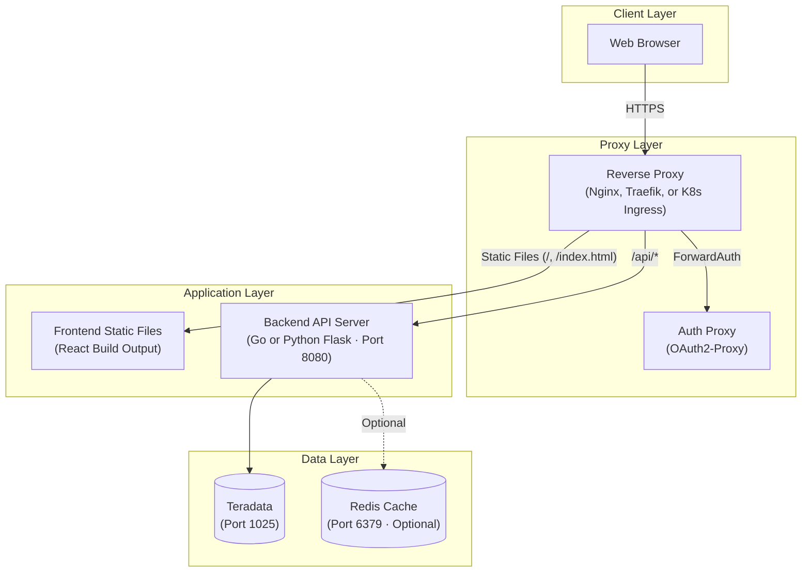

# Operations Guide

This guide enables an operations team to deploy the Lineage application from scratch. It covers prerequisites, installation, configuration, database setup, and running the application.

**Related documentation:**
- [User Guide](user_guide.md) -- End-user feature documentation
- [Security Documentation](SECURITY.md) -- Production security requirements (TLS, authentication proxy, rate limiting, CORS)

## Table of Contents

1. [Prerequisites](#prerequisites)
2. [Installation](#installation)
3. [Configuration](#configuration)
4. [Database Setup](#database-setup)
5. [Running the Application](#running-the-application)
6. [Production Deployment](#production-deployment)
7. [Architecture](#architecture)
8. [Troubleshooting](#troubleshooting)

---

## Prerequisites

### Required

| Software | Minimum Version | Purpose |
|----------|----------------|---------|
| Python | 3.9+ | Backend server (Flask) and database setup scripts |
| Node.js | 18+ | Frontend build and development |
| npm | (included with Node.js) | Frontend package management |
| Teradata access | -- | Network connectivity to a Teradata instance on port 1025 (or configured port) |

**Teradata QVCI:** The Teradata instance must have QVCI (Queryable View Column Index) enabled. This is a system-level configuration that requires DBA coordination and a database restart. If QVCI is not already enabled on your Teradata system, plan for a maintenance window before beginning deployment. See [Database Setup > Verify QVCI Status](#41-verify-qvci-status) for verification and enablement instructions.

### Optional

| Software | Minimum Version | Purpose |
|----------|----------------|---------|
| Go | 1.23+ | Only needed if running the Go backend instead of the Python backend |
| Redis | 6+ | Optional caching layer; the application falls back gracefully without Redis |

**Redis** is only beneficial for high-traffic production deployments. Most deployments do not need Redis. If Redis is unavailable, the application continues to operate normally without caching.

### Backend Choice

Both a Go backend and a Python (Flask) backend are provided. They serve the same API endpoints and are interchangeable.

| Backend | Advantages | When to Use |
|---------|-----------|-------------|
| Python (Flask) | No compilation, simpler deployment, fewer prerequisites | Most deployments |
| Go | Better performance, built-in Redis caching, structured JSON logging | High-concurrency production environments |

---

## Installation

### Step 1: Clone the Repository

```bash
git clone <repository-url>
cd lineage
```

### Step 2: Set Up Python Environment

```bash
python3 -m venv .venv
source .venv/bin/activate        # Linux / macOS
# .venv\Scripts\activate         # Windows

pip install -r requirements.txt
```

The Python environment is required regardless of backend choice. It is used by the database setup scripts and the Python backend.

**Python dependencies installed:** `teradatasql`, `flask`, `flask-cors`, `requests`, `python-dotenv`, `sqlglot`.

### Step 3: Configure Environment

```bash
cp .env.example .env
```

Edit `.env` with your Teradata credentials. At minimum, set `TERADATA_HOST` and `TERADATA_PASSWORD`. See the [Configuration](#configuration) section for the full variable reference.

### Step 4: Build the Frontend

```bash
cd lineage-ui
npm install
npm run build        # Creates dist/ directory with production-ready static files
```

### Step 5 (Optional): Build the Go Backend

Only needed if you intend to run the Go backend instead of the Python backend.

```bash
cd lineage-api
make build           # Creates bin/server binary
```

---

## Configuration

### Precedence

Configuration values are resolved in the following order (highest precedence first):

1. **Environment variables** -- Always take precedence
2. **`.env` file** -- In the project root directory
3. **`config.yaml`** -- Go backend only; in the `lineage-api/` directory
4. **Default values** -- Built into the application

### Environment Variable Reference

| Variable | Description | Default | Required | Used By |
|----------|-------------|---------|----------|---------|
| `TERADATA_HOST` | Teradata hostname or IP address | -- | Yes | All |
| `TERADATA_USER` | Teradata username | `demo_user` | No | All |
| `TERADATA_PASSWORD` | Teradata password | -- | Yes | All |
| `TERADATA_DATABASE` | Default database name | `demo_user` | No | All |
| `TERADATA_PORT` | Teradata port number | `1025` | No | All |
| `API_PORT` | HTTP server port | `8080` | No | Backend |
| `REDIS_ADDR` | Redis server address | `localhost:6379` | No | Go backend |
| `REDIS_PASSWORD` | Redis password | (empty) | No | Go backend |
| `REDIS_DB` | Redis database number | `0` | No | Go backend |
| `VALIDATION_MAX_DEPTH_LIMIT` | Maximum traversal depth upper bound | `20` | No | Go backend |
| `VALIDATION_DEFAULT_MAX_DEPTH` | Default lineage traversal depth | `5` | No | Go backend |
| `VALIDATION_MIN_MAX_DEPTH` | Minimum traversal depth lower bound | `1` | No | Go backend |
| `CACHE_TTL_LINEAGE` | Cache TTL for lineage graphs (seconds) | `1800` | No | Go backend |
| `CACHE_TTL_ASSETS` | Cache TTL for asset listings (seconds) | `900` | No | Go backend |
| `CACHE_TTL_STATISTICS` | Cache TTL for table statistics (seconds) | `900` | No | Go backend |
| `CACHE_TTL_DDL` | Cache TTL for DDL definitions (seconds) | `1800` | No | Go backend |
| `CACHE_TTL_SEARCH` | Cache TTL for search results (seconds) | `300` | No | Go backend |

**"Used By" key:**
- **All** = Python backend, Go backend, and database scripts
- **Backend** = Both Python and Go backends
- **Go backend** = Go backend only

### Legacy Variables (Fallbacks)

The following legacy variable names are still supported as fallbacks. Use the primary names listed in the reference table above.

| Legacy Variable | Replaced By | Notes |
|----------------|-------------|-------|
| `TD_HOST` | `TERADATA_HOST` | |
| `TD_USER` | `TERADATA_USER` | |
| `TD_PASSWORD` | `TERADATA_PASSWORD` | |
| `TD_DATABASE` | `TERADATA_DATABASE` | |
| `PORT` | `API_PORT` | |

If both the legacy and primary variable are set, the primary variable takes precedence.

### Go Server Configuration File

The Go backend optionally reads a `config.yaml` file from the `lineage-api/` directory. This file is not required. Any values set in environment variables or `.env` take precedence over `config.yaml`.

### Server Timeouts (Go Backend)

The Go backend has the following built-in timeouts:

| Timeout | Value | Description |
|---------|-------|-------------|
| Read timeout | 15 seconds | Maximum time to read the full request |
| Write timeout | 60 seconds | Maximum time to write the full response |
| Idle timeout | 60 seconds | Maximum time to keep idle connections open |
| Graceful shutdown | 30 seconds | Time allowed for in-flight requests to complete on shutdown |

These timeouts are compiled into the binary and are not configurable via environment variables.

---

## Database Setup

### 4.1 Verify QVCI Status

QVCI (Queryable View Column Index) is a Teradata feature that enables efficient retrieval of view column information via the `DBC.ColumnsJQV` system view. The lineage application requires QVCI to extract complete column metadata (including data types) for both tables and views.

**Check if QVCI is enabled:**

```sql
-- Try querying DBC.ColumnsJQV
-- If you receive error 9719 ("QVCI feature is disabled"), QVCI needs to be enabled
SELECT TOP 1 * FROM DBC.ColumnsJQV;
```

If the query returns a result, QVCI is enabled. If you receive error 9719, follow the enablement steps below.

**Enable QVCI (requires DBA privileges):**

```bash
dbscontrol << EOF
M internal 551=false
W
EOF
```

After running this command, **restart the Teradata Database** for the change to take effect. This is a system-level change that requires DBA privileges and a maintenance window.

**If QVCI cannot be enabled:** A fallback approach is available. Modify `database/scripts/populate/populate_lineage.py` to use `DBC.ColumnsV` instead of `DBC.ColumnsJQV` in the `populate_openlineage_fields()` function, and re-enable the `update_view_column_types()` function (see git history for the original implementation). This fallback uses `HELP COLUMN` commands for each view column, which is slower but works without QVCI.

### 4.2 Create Schema

```bash
cd database
python scripts/setup/setup_lineage_schema.py
```

This creates 9 OpenLineage tables with 17 indexes:

| Table | Purpose |
|-------|---------|
| `OL_NAMESPACE` | Data source namespaces (teradata://host:port) |
| `OL_DATASET` | Dataset registry (tables/views) |
| `OL_DATASET_FIELD` | Field definitions (columns) |
| `OL_JOB` | Job definitions (ETL processes) |
| `OL_RUN` | Job execution runs |
| `OL_RUN_INPUT` | Run input datasets |
| `OL_RUN_OUTPUT` | Run output datasets |
| `OL_COLUMN_LINEAGE` | Column-level lineage with transformation types |
| `OL_SCHEMA_VERSION` | Schema version tracking |

### 4.3 Create Test Data (Optional)

For testing and demo purposes only. Not needed for production deployments with existing Teradata tables.

```bash
python scripts/setup/setup_test_data.py
```

This creates sample medallion architecture tables (SRC -> STG -> DIM -> FACT) in the configured database. These tables provide a working example of multi-tier data lineage.

### 4.4 Populate Lineage Data

Two population methods are available depending on your environment.

**DBQL mode (default)** -- extracts lineage from executed SQL in Teradata query logs:

```bash
python scripts/populate/populate_lineage.py                                # Default - uses DBQL
python scripts/populate/populate_lineage.py --dbql --since "2024-01-01"    # DBQL since a specific date
```

DBQL mode requires SELECT privileges on `DBC.DBQLogTbl` and `DBC.DBQLSQLTbl`. The Teradata user specified in your configuration must have access to these system views.

**Fixtures mode** -- uses hardcoded column mappings for demo and testing:

```bash
python scripts/populate/populate_lineage.py --fixtures
```

**Dry run** -- preview what would be populated without making changes:

```bash
python scripts/populate/populate_lineage.py --dry-run
```

**Populate metadata** -- after populating lineage data, populate the metadata for the tables:

```bash
python scripts/populate/populate_test_metadata.py
```

This populates `OL_NAMESPACE`, `OL_DATASET`, and `OL_DATASET_FIELD` records for the tables referenced in the lineage data.

---

## Running the Application

### 5.1 Start the Backend

#### Python Backend (recommended for most deployments)

```bash
cd lineage-api
python python_server.py        # Starts on port 8080 (or API_PORT)
```

#### Go Backend

```bash
cd lineage-api
make build && ./bin/server     # Build and run
# Or run without building:
go run cmd/server/main.go
```

Both backends serve the same API endpoints and are interchangeable. The Python backend is simpler to deploy (no compilation step). The Go backend offers better performance and includes built-in Redis caching support.

### 5.2 Start the Frontend

#### Development mode (hot reload, proxies API to localhost:8080)

```bash
cd lineage-ui
npm run dev        # Starts on port 3000 or 5173
```

The Vite development server proxies `/api/*` requests to `http://localhost:8080` automatically.

#### Production mode (static files served by a web server)

```bash
cd lineage-ui
npm run build      # Outputs static files to dist/ directory
```

The `dist/` directory contains static HTML, CSS, and JavaScript files. In production, serve these files using a reverse proxy (Nginx, Traefik, etc.) that also proxies `/api/*` requests to the backend. See the [Production Deployment](#production-deployment) section and [Security Documentation](SECURITY.md) for reverse proxy configuration examples.

**Do not use `npm run dev` in production.** The Vite development server is not designed for production use.

### 5.3 Verify the Deployment

```bash
# Check backend health
curl http://localhost:8080/health

# Check API endpoint
curl http://localhost:8080/api/v2/openlineage/namespaces

# Access the frontend
# Development: http://localhost:3000 or http://localhost:5173
# Production: your configured domain
```

A successful health check returns HTTP 200. The namespaces endpoint returns a JSON array of configured namespaces, confirming both the backend and database connection are working.

### 5.4 Startup Order

Start components in the following order:

1. **Teradata database** -- must already be running and accessible
2. **Redis** (optional) -- start before the backend if using caching
3. **Backend server** -- Python or Go
4. **Frontend** -- development server or web server serving static files

---

## Production Deployment

The application is designed to run behind a reverse proxy that handles authentication, TLS termination, rate limiting, and security headers. The application itself does NOT implement authentication -- this is intentional. See [Security Documentation](SECURITY.md) for complete configuration examples including Traefik + Docker Compose, Nginx, and Kubernetes Ingress.

### 6.1 Security Overview

| Requirement | Description | Details |
|-------------|-------------|---------|
| Authentication | API must be behind an auth proxy (OAuth2-Proxy, API Gateway) | [SECURITY.md - Authentication](SECURITY.md#2-authentication-requirements) |
| TLS | All traffic must use HTTPS (TLS 1.2 minimum, TLS 1.3 recommended) | [SECURITY.md - TLS](SECURITY.md#1-tls-requirements) |
| Security Headers | Reverse proxy must add HSTS, X-Content-Type-Options, X-Frame-Options, Referrer-Policy, Cache-Control | [SECURITY.md - Headers](SECURITY.md#4-security-headers) |
| CORS | Restrict allowed origins to your domain (never use wildcard `*`) | [SECURITY.md - CORS](SECURITY.md#5-cors-configuration) |
| Rate Limiting | Configure per-endpoint rate limits at the proxy level | See [Rate Limiting](#62-rate-limiting) below |

**Note:** The application's built-in CORS configuration (`localhost:3000`, `localhost:5173`) is for development only. In production, CORS must be configured at the reverse proxy level with your actual domain.

### 6.2 Rate Limiting

Configure rate limiting at the reverse proxy or API gateway level. The following limits are recommended by endpoint category:

| Endpoint | Per-IP Limit | Per-User Limit | Rationale |
|----------|-------------|----------------|-----------|
| `GET /api/v*/assets/*` | 100/min | 300/min | Normal browsing |
| `GET /api/v*/lineage/{id}` | 100/min | 300/min | Normal browsing |
| `GET /api/v*/search` | 30/min | 60/min | Heavier database queries |
| `GET /api/v*/lineage/{id}/impact` | 20/min | 40/min | Expensive recursive queries |
| `GET /health` | 1000/min | unlimited | Monitoring systems |

**Burst handling:** Allow a burst of 10-20 requests above the stated limits. Use a sliding window algorithm for smoother limiting rather than fixed windows.

See [SECURITY.md - Rate Limiting](SECURITY.md#3-rate-limiting-requirements) for proxy-specific configuration examples (Traefik, Nginx, Kubernetes Ingress).

### 6.3 Frontend Production Serving

Build the frontend for production:

```bash
cd lineage-ui
npm run build    # Outputs to dist/
```

The `dist/` directory contains static HTML, CSS, and JavaScript. Configure your reverse proxy to:

1. Serve files from `dist/` for all non-API paths
2. Proxy `/api/*` requests to the backend (port 8080 by default)
3. Return `index.html` for all client-side routes (SPA fallback)

Example Nginx location block:

```nginx
# Serve frontend static files
location / {
    root /path/to/lineage-ui/dist;
    try_files $uri $uri/ /index.html;
}

# Proxy API requests to backend
location /api/ {
    proxy_pass http://127.0.0.1:8080;
    proxy_set_header Host $host;
    proxy_set_header X-Real-IP $remote_addr;
}
```

**Do not use `npm run dev` in production.** The Vite development server is not designed for production use.

### 6.4 Deployment Checklist

Verify each item before going live:

- [ ] Teradata credentials configured and tested
- [ ] QVCI enabled on Teradata instance (see [Database Setup](#41-verify-qvci-status))
- [ ] OL_* schema created and lineage data populated
- [ ] Backend starts without errors
- [ ] Frontend built (`npm run build`)
- [ ] Reverse proxy configured with TLS
- [ ] Authentication proxy configured and tested
- [ ] Rate limiting configured
- [ ] Security headers verified (see [SECURITY.md - Verification Checklist](SECURITY.md#verification-checklist))
- [ ] Health endpoint accessible: `curl https://your-domain/health`

---

## Architecture

### Deployment Architecture



**Layer descriptions:**

- **Client Layer:** Web browsers access the application over HTTPS. All HTTP requests are redirected to HTTPS by the reverse proxy.
- **Proxy Layer:** The reverse proxy terminates TLS, enforces authentication via ForwardAuth to an OAuth2-Proxy, applies rate limiting, and injects security headers. See [Security Documentation](SECURITY.md) for complete proxy configuration examples.
- **Application Layer:** The frontend is a set of static files built from React (`npm run build`). The backend is a Go or Python Flask server providing REST API endpoints. The frontend proxies API requests through the reverse proxy.
- **Data Layer:** Teradata stores lineage metadata in OL_* tables (see [Database Setup](#database-setup)). Redis provides optional caching for the Go backend. The Python backend does not use Redis. The application operates normally without Redis.

### Component Communication

| From | To | Protocol | Port |
|------|----|----------|------|
| Browser | Reverse Proxy | HTTPS | 443 |
| Reverse Proxy | Auth Proxy | HTTP | 4180 |
| Reverse Proxy | Frontend Files | File system | -- |
| Reverse Proxy | Backend API | HTTP | 8080 |
| Backend API | Teradata | TCP (Teradata) | 1025 |
| Backend API | Redis (optional) | TCP (Redis) | 6379 |

---

## Troubleshooting

### Cannot Connect to Teradata

**Symptoms:** `Connection refused` or `Login failure` errors on backend startup.

**Cause:** Incorrect hostname, port, or credentials in configuration.

**Solution:**

1. Verify `TERADATA_HOST`, `TERADATA_USER`, and `TERADATA_PASSWORD` in `.env`
2. Test connectivity directly:
   ```bash
   python -c "import teradatasql; teradatasql.connect(host='YOUR_HOST', user='YOUR_USER', password='YOUR_PASS')"
   ```
3. Check firewall rules for port 1025 (or your configured `TERADATA_PORT`)
4. Confirm the Teradata instance is running and accepting connections

### QVCI Feature is Disabled (Error 9719)

**Symptoms:** `populate_lineage.py` fails with error 9719 during metadata extraction.

**Cause:** QVCI is not enabled on the Teradata instance.

**Solution:** See [Database Setup > Verify QVCI Status](#41-verify-qvci-status) for verification and enablement instructions. Enabling QVCI requires DBA privileges and a database restart. If QVCI cannot be enabled, modify `populate_lineage.py` to use `DBC.ColumnsV` instead of `DBC.ColumnsJQV` (see the fallback instructions in [Database Setup](#41-verify-qvci-status)).

### Empty Lineage Graph

**Symptoms:** Graph page shows "No lineage data found" or renders with no edges.

**Cause:** The `OL_COLUMN_LINEAGE` table is empty or not populated for the selected column.

**Solution:**

1. Run `populate_lineage.py` to populate lineage data (see [Database Setup > Populate Lineage Data](#44-populate-lineage-data))
2. Verify data exists:
   ```sql
   SELECT COUNT(*) FROM OL_COLUMN_LINEAGE;
   ```
3. For DBQL mode, ensure the Teradata user has SELECT privileges on `DBC.DBQLogTbl` and `DBC.DBQLSQLTbl`

### Port Already in Use

**Symptoms:** `Address already in use` error when starting the backend.

**Cause:** Another process is using port 8080 (or your configured `API_PORT`).

**Solution:**

1. Change `API_PORT` in `.env` to a different port, or
2. Stop the conflicting process:
   ```bash
   # macOS / Linux: identify the process using port 8080
   lsof -i :8080
   ```

### Redis Connection Failed

**Symptoms:** Warning in Go backend logs about Redis connection failure.

**Cause:** Redis is not running or not reachable at the configured `REDIS_ADDR`.

**Solution:** This is **non-fatal** -- the application falls back to operating without caching. No action is required unless you want caching enabled.

To enable Redis:
1. Start a Redis server
2. Verify `REDIS_ADDR` in `.env` points to the correct host and port

**Note:** Redis is only used by the Go backend. The Python backend does not use Redis, so this warning will not appear when using the Python backend.

**Verifying cache is active:**

When the Go backend starts with Redis available, the logs will show:
```
level=INFO msg="Redis cache connected" addr=localhost:6379
```

If Redis is unavailable, the logs will show:
```
level=WARN msg="Redis unavailable, running without cache" error="..."
```

**Monitoring cache effectiveness:**

API responses include cache status headers on all v2 endpoints:
- `X-Cache: HIT` -- response served from Redis cache
- `X-Cache: MISS` -- response fetched from Teradata
- `X-Cache-TTL: N` -- seconds until expiration (only on HIT)

Use these headers to monitor cache hit rates. A high proportion of MISS responses may indicate TTLs are too short for the access pattern.

**Forcing fresh data:**

Add `?refresh=true` to any v2 API request to bypass the cache. This is useful when data has been updated in Teradata and the cached response is stale. The UI also provides refresh buttons in the lineage toolbar and asset browser.

**Clearing all cached data:**

To clear all cached data, flush the Redis database:
```bash
redis-cli -h <host> -p <port> FLUSHDB
```

Or restart Redis. The application will automatically repopulate the cache on subsequent requests.

### Frontend Build Fails

**Symptoms:** `npm run build` fails with compilation errors.

**Cause:** Missing dependencies or incompatible Node.js version.

**Solution:**

1. Verify Node.js version is 18 or higher:
   ```bash
   node --version
   ```
2. Delete `node_modules` and reinstall:
   ```bash
   cd lineage-ui
   rm -rf node_modules
   npm install
   ```
3. Retry the build:
   ```bash
   npm run build
   ```
4. If TypeScript errors persist, review the build output for specific file and line references

### Slow Graph Loading

**Symptoms:** Large lineage graphs take more than 30 seconds to render.

**Cause:** Deep lineage traversal or wide fan-out patterns generating large result sets.

**Solution:**

1. Reduce the traversal depth in the UI toolbar (default is 5; try 3)
2. For the Go backend, set `VALIDATION_DEFAULT_MAX_DEPTH` to a lower value in `.env`
3. Enable Redis caching (Go backend only) to cache frequently accessed lineage graphs
4. Check if the Teradata instance has the recommended indexes on `OL_COLUMN_LINEAGE` (created by `setup_lineage_schema.py`)

### Frontend Cannot Reach Backend API

**Symptoms:** Network errors in the browser console; "Loading..." spinner never resolves.

**Cause:** Backend not running, wrong port, or CORS misconfiguration.

**Solution:**

1. Verify the backend is running:
   ```bash
   curl http://localhost:8080/health
   ```
2. **In development:** The Vite development server proxies `/api/*` to `localhost:8080` automatically. Ensure the backend is running on port 8080 (or update the proxy target in `lineage-ui/vite.config.ts`)
3. **In production:** Verify the reverse proxy routes `/api/*` requests to the backend. Check the proxy configuration and backend logs for errors

### Teradata Driver Not Found

**Symptoms:** `ModuleNotFoundError: No module named 'teradatasql'` when running Python scripts.

**Cause:** Python virtual environment not activated or dependencies not installed.

**Solution:**

1. Activate the virtual environment:
   ```bash
   source .venv/bin/activate
   ```
2. Install dependencies:
   ```bash
   pip install -r requirements.txt
   ```
3. Verify installation:
   ```bash
   python -c "import teradatasql; print(teradatasql.__version__)"
   ```

### Schema Already Exists

**Symptoms:** `setup_lineage_schema.py` fails with "table already exists" errors.

**Cause:** Running the schema setup script on a database that already has OL_* tables.

**Solution:** The script is idempotent for indexes but not for tables. If you need to recreate the schema:

1. Back up any existing lineage data
2. Drop the existing OL_* tables
3. Re-run the schema setup script:
   ```bash
   cd database
   python scripts/setup/setup_lineage_schema.py
   ```
