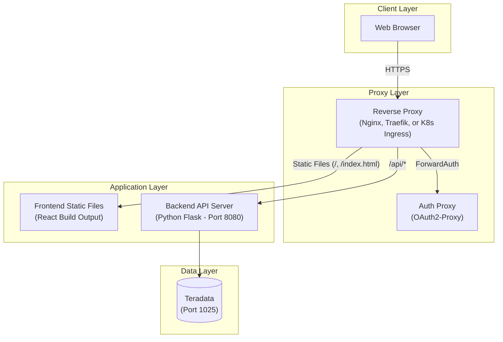

# Operations Guide

This guide enables an operations team to deploy the Lineage application from scratch. It covers prerequisites, installation, configuration, database setup, and running the application.

**Related documentation:**
- [User Guide](user_guide.md) -- End-user feature documentation
- [Security Documentation](SECURITY.md) -- Production security requirements (TLS, authentication proxy, rate limiting, CORS)

## Table of Contents

1. [Prerequisites](#prerequisites)
2. [Installation](#installation)
3. [Configuration](#configuration)
4. [Database Setup](#database-setup)
5. [Running the Application](#running-the-application)
6. [Logging and Observability](#logging-and-observability)
7. [Production Deployment](#production-deployment)
8. [Architecture](#architecture)
9. [Troubleshooting](#troubleshooting)

---

## Prerequisites

### Required

| Software | Minimum Version | Purpose |
|----------|----------------|---------|
| Python | 3.9+ | Backend server (Flask) and database setup scripts |
| Node.js | 18+ | Frontend build and development |
| npm | (included with Node.js) | Frontend package management |
| Teradata access | -- | Network connectivity to a Teradata instance on port 1025 (or configured port) |

**Teradata QVCI:** The Teradata instance must have QVCI (Queryable View Column Index) enabled. This is a system-level configuration that requires DBA coordination and a database restart. If QVCI is not already enabled on your Teradata system, plan for a maintenance window before beginning deployment. See [Database Setup > Verify QVCI Status](#41-verify-qvci-status) for verification and enablement instructions.

---

## Installation

### Step 1: Clone the Repository

```bash
git clone <repository-url>
cd lineage
```

### Step 2: Set Up Python Environment

```bash
python3 -m venv .venv
source .venv/bin/activate        # Linux / macOS
# .venv\Scripts\activate         # Windows

pip install -r requirements.txt
```

The Python environment is required for both the backend server and the database setup scripts.

**Python dependencies installed:** `teradatasql`, `flask`, `flask-cors`, `requests`, `python-dotenv`, `sqlglot`.

### Step 3: Configure Environment

```bash
cp .env.example .env
```

Edit `.env` with your Teradata credentials. At minimum, set `TERADATA_HOST` and `TERADATA_PASSWORD`. See the [Configuration](#configuration) section for the full variable reference.

### Step 4: Build the Frontend

```bash
cd lineage-ui
npm install
npm run build        # Creates dist/ directory with production-ready static files
```

---

## Configuration

### Precedence

Configuration values are resolved in the following order (highest precedence first):

1. **Environment variables** -- Always take precedence
2. **`.env` file** -- In the project root directory
3. **Default values** -- Built into the application

### Environment Variable Reference

| Variable | Description | Default | Required |
|----------|-------------|---------|----------|
| `TERADATA_HOST` | Teradata hostname or IP address | -- | Yes |
| `TERADATA_USER` | Teradata username | `demo_user` | No |
| `TERADATA_PASSWORD` | Teradata password | -- | Yes |
| `TERADATA_DATABASE` | Default database name | `demo_user` | No |
| `TERADATA_PORT` | Teradata port number | `1025` | No |
| `API_PORT` | HTTP server port | `8080` | No |

### Legacy Variables (Fallbacks)

The following legacy variable names are still supported as fallbacks. Use the primary names listed in the reference table above.

| Legacy Variable | Replaced By |
|----------------|-------------|
| `TD_HOST` | `TERADATA_HOST` |
| `TD_USER` | `TERADATA_USER` |
| `TD_PASSWORD` | `TERADATA_PASSWORD` |
| `TD_DATABASE` | `TERADATA_DATABASE` |
| `PORT` | `API_PORT` |

If both the legacy and primary variable are set, the primary variable takes precedence.

---

## Database Setup

### 4.1 Verify QVCI Status

QVCI (Queryable View Column Index) is a Teradata feature that enables efficient retrieval of view column information via the `DBC.ColumnsJQV` system view. The lineage application requires QVCI to extract complete column metadata (including data types) for both tables and views.

**Check if QVCI is enabled:**

```sql
-- Try querying DBC.ColumnsJQV
-- If you receive error 9719 ("QVCI feature is disabled"), QVCI needs to be enabled
SELECT TOP 1 * FROM DBC.ColumnsJQV;
```

If the query returns a result, QVCI is enabled. If you receive error 9719, follow the enablement steps below.

**Enable QVCI (requires DBA privileges):**

```bash
dbscontrol << EOF
M internal 551=false
W
EOF
```

After running this command, **restart the Teradata Database** for the change to take effect. This is a system-level change that requires DBA privileges and a maintenance window.

**If QVCI cannot be enabled:** A fallback approach is available. Modify `database/scripts/populate/populate_lineage.py` to use `DBC.ColumnsV` instead of `DBC.ColumnsJQV` in the `populate_openlineage_fields()` function, and re-enable the `update_view_column_types()` function (see git history for the original implementation). This fallback uses `HELP COLUMN` commands for each view column, which is slower but works without QVCI.

### 4.2 Create Schema

```bash
cd database
python scripts/setup/setup_lineage_schema.py
```

This creates 9 OpenLineage tables with 17 indexes:

| Table | Purpose |
|-------|---------|
| `OL_NAMESPACE` | Data source namespaces (teradata://host:port) |
| `OL_DATASET` | Dataset registry (tables/views) |
| `OL_DATASET_FIELD` | Field definitions (columns) |
| `OL_JOB` | Job definitions (ETL processes) |
| `OL_RUN` | Job execution runs |
| `OL_RUN_INPUT` | Run input datasets |
| `OL_RUN_OUTPUT` | Run output datasets |
| `OL_COLUMN_LINEAGE` | Column-level lineage with transformation types |
| `OL_SCHEMA_VERSION` | Schema version tracking |

### 4.3 Create Test Data (Optional)

For testing and demo purposes only. Not needed for production deployments with existing Teradata tables.

```bash
python scripts/setup/setup_test_data.py
```

This creates sample medallion architecture tables (SRC -> STG -> DIM -> FACT) in the configured database. These tables provide a working example of multi-tier data lineage.

### 4.4 Populate Lineage Data

Two population methods are available depending on your environment.

**DBQL mode (default)** -- extracts lineage from executed SQL in Teradata query logs:

```bash
python scripts/populate/populate_lineage.py                                # Default - uses DBQL
python scripts/populate/populate_lineage.py --dbql --since "2024-01-01"    # DBQL since a specific date
```

DBQL mode requires SELECT privileges on `DBC.DBQLogTbl` and `DBC.DBQLSQLTbl`. The Teradata user specified in your configuration must have access to these system views.

**Fixtures mode** -- uses hardcoded column mappings for demo and testing:

```bash
python scripts/populate/populate_lineage.py --fixtures
```

**Dry run** -- preview what would be populated without making changes:

```bash
python scripts/populate/populate_lineage.py --dry-run
```

**Populate metadata** -- after populating lineage data, populate the metadata for the tables:

```bash
python scripts/populate/populate_test_metadata.py
```

This populates `OL_NAMESPACE`, `OL_DATASET`, and `OL_DATASET_FIELD` records for the tables referenced in the lineage data.

---

## Running the Application

### 5.1 Start the Backend

```bash
cd lineage-api
python python_server.py        # Starts on port 8080 (or API_PORT)
```

No compilation or additional drivers required.

### 5.2 Start the Frontend

#### Development mode (hot reload, proxies API to localhost:8080)

```bash
cd lineage-ui
npm run dev        # Starts on port 3000 or 5173
```

The Vite development server proxies `/api/*` requests to `http://localhost:8080` automatically.

#### Production mode (static files served by a web server)

```bash
cd lineage-ui
npm run build      # Outputs static files to dist/ directory
```

The `dist/` directory contains static HTML, CSS, and JavaScript files. In production, serve these files using a reverse proxy (Nginx, Traefik, etc.) that also proxies `/api/*` requests to the backend. See the [Production Deployment](#production-deployment) section and [Security Documentation](SECURITY.md) for reverse proxy configuration examples.

**Do not use `npm run dev` in production.** The Vite development server is not designed for production use.

### 5.3 Verify the Deployment

```bash
# Check backend health
curl http://localhost:8080/health

# Check API endpoint
curl http://localhost:8080/api/v2/openlineage/namespaces

# Access the frontend
# Development: http://localhost:3000 or http://localhost:5173
# Production: your configured domain
```

A successful health check returns HTTP 200. The namespaces endpoint returns a JSON array of configured namespaces, confirming both the backend and database connection are working.

### 5.4 Startup Order

Start components in the following order:

1. **Teradata database** -- must already be running and accessible
2. **Backend server** -- Python Flask
3. **Frontend** -- development server or web server serving static files

---

## Logging and Observability

The backend uses structured JSON logging for both local debugging and production observability. All logs include correlation IDs for request tracing.

### 6.1 Log Output

The application writes logs to two destinations simultaneously:

| Destination | Path | Format | Purpose |
|-------------|------|--------|---------|
| **stdout** | Console output | JSON | Container environments, log aggregators |
| **File** | `lineage-api/logs/lineage-api.log` | JSON | Local debugging, persistent storage |

Both sinks use identical JSON format for consistent parsing.

### 6.2 Log Format

All log entries are JSON objects with the following structure:

```json
{
  "text": "Request started GET /api/v2/openlineage/namespaces",
  "record": {
    "elapsed": {"repr": "0:00:00.001234", "seconds": 0.001234},
    "exception": null,
    "extra": {"correlation_id": "a1b2c3d4-e5f6-7890-abcd-ef1234567890"},
    "file": {"name": "python_server.py", "path": "/path/to/lineage-api/python_server.py"},
    "function": "before_request",
    "level": {"icon": "ℹ️", "name": "INFO", "no": 20},
    "line": 45,
    "message": "Request started GET /api/v2/openlineage/namespaces",
    "module": "python_server",
    "name": "lineage-api",
    "process": {"id": 12345, "name": "MainProcess"},
    "thread": {"id": 67890, "name": "MainThread"},
    "time": {"repr": "2026-02-15 13:30:45.123456-08:00", "timestamp": 1739654445.123456}
  }
}
```

**Key fields for debugging:**
- `text` -- Human-readable message
- `record.extra.correlation_id` -- Unique ID for tracking requests across multiple log entries
- `record.level.name` -- Log level (INFO, WARNING, ERROR)
- `record.file.name` and `record.line` -- Source code location
- `record.time.repr` -- Timestamp with timezone

### 6.3 Correlation IDs

Every API request is assigned a unique correlation ID (UUID4) that appears in:
- Log entries (in `record.extra.correlation_id`)
- HTTP response headers (`X-Correlation-ID`)
- Error responses (in the JSON body)

Use correlation IDs to trace all log entries related to a single request:

```bash
# Extract all logs for a specific request
grep "a1b2c3d4-e5f6-7890-abcd-ef1234567890" lineage-api/logs/lineage-api.log

# Parse JSON and extract relevant fields
grep "a1b2c3d4-e5f6-7890-abcd-ef1234567890" lineage-api/logs/lineage-api.log | \
  jq -r '[.record.time.repr, .record.level.name, .text] | @tsv'
```

### 6.4 Log Rotation and Retention

The file sink automatically rotates logs to prevent unbounded disk usage:

| Parameter | Value | Description |
|-----------|-------|-------------|
| **Rotation** | 100 MB | When `lineage-api.log` reaches 100 MB, it's renamed with a timestamp suffix and a new file is created |
| **Retention** | 30 days | Rotated files older than 30 days are automatically deleted |
| **Compression** | gzip | Rotated files are compressed to `.log.gz` to save disk space |

**Example rotated files:**
```
logs/lineage-api.log              # Current log file
logs/lineage-api.2026-02-14.log.gz    # Yesterday's compressed log
logs/lineage-api.2026-02-13.log.gz    # 2 days ago
```

The `logs/` directory is excluded from version control (`.gitignore`) and should be excluded from backups.

### 6.5 Parsing Logs

Use `jq` to parse and filter JSON logs:

```bash
# Show only ERROR level logs
jq -r 'select(.record.level.name == "ERROR") | .text' logs/lineage-api.log

# Extract timestamps and messages
jq -r '[.record.time.repr, .text] | @tsv' logs/lineage-api.log

# Find all logs related to a specific table
jq -r 'select(.text | contains("DIM_CUSTOMER")) | .text' logs/lineage-api.log

# Count logs by level
jq -r '.record.level.name' logs/lineage-api.log | sort | uniq -c
```

### 6.6 Integration with Log Aggregators

The JSON output to stdout is designed for container environments and log aggregation platforms:

**Docker/Kubernetes:**
```bash
# Logs go to stdout and are collected by the container runtime
docker logs <container-id>
kubectl logs <pod-name>
```

**Splunk/Elasticsearch/Datadog:**
Configure your log shipper (Fluentd, Logstash, Filebeat) to:
1. Read from stdout (container logs) or the `logs/lineage-api.log` file
2. Parse as JSON (no custom parsing rules needed)
3. Index the `record.extra.correlation_id` field for request tracing
4. Create alerts on `record.level.name == "ERROR"`

### 6.7 Log Levels

The application uses the following log levels:

| Level | Usage | Examples |
|-------|-------|----------|
| **INFO** | Normal operations, request lifecycle | Request started, response sent, database query executed |
| **WARNING** | Recoverable issues, degraded state | SQL truncation detected, slow query (>5s) |
| **ERROR** | Request failures, exceptions | 404 not found, 500 internal error, database connection failed |

All levels are logged to both stdout and the file sink. To change the log level, modify `lineage-api/utils/logging_config.py` and restart the backend.

### 6.8 Troubleshooting with Logs

**Find all errors in the last hour:**
```bash
jq -r 'select(.record.level.name == "ERROR" and (.record.time.timestamp > (now - 3600))) | .text' logs/lineage-api.log
```

**Trace a failed request:**
1. Get the correlation ID from the error response or browser network tab
2. Extract all logs for that request:
   ```bash
   grep "<correlation-id>" logs/lineage-api.log | jq -r '.text'
   ```

**Check for database connection issues:**
```bash
jq -r 'select(.text | contains("Teradata") or contains("database")) | .text' logs/lineage-api.log
```

---

## Production Deployment

The application is designed to run behind a reverse proxy that handles authentication, TLS termination, rate limiting, and security headers. The application itself does NOT implement authentication -- this is intentional. See [Security Documentation](SECURITY.md) for complete configuration examples including Traefik + Docker Compose, Nginx, and Kubernetes Ingress.

### 7.1 Security Overview

| Requirement | Description | Details |
|-------------|-------------|---------|
| Authentication | API must be behind an auth proxy (OAuth2-Proxy, API Gateway) | [SECURITY.md - Authentication](SECURITY.md#2-authentication-requirements) |
| TLS | All traffic must use HTTPS (TLS 1.2 minimum, TLS 1.3 recommended) | [SECURITY.md - TLS](SECURITY.md#1-tls-requirements) |
| Security Headers | Reverse proxy must add HSTS, X-Content-Type-Options, X-Frame-Options, Referrer-Policy, Cache-Control | [SECURITY.md - Headers](SECURITY.md#4-security-headers) |
| CORS | Restrict allowed origins to your domain (never use wildcard `*`) | [SECURITY.md - CORS](SECURITY.md#5-cors-configuration) |
| Rate Limiting | Configure per-endpoint rate limits at the proxy level | See [Rate Limiting](#72-rate-limiting) below |

**Note:** The application's built-in CORS configuration (`localhost:3000`, `localhost:5173`) is for development only. In production, CORS must be configured at the reverse proxy level with your actual domain.

### 7.2 Rate Limiting

Configure rate limiting at the reverse proxy or API gateway level. The following limits are recommended by endpoint category:

| Endpoint | Per-IP Limit | Per-User Limit | Rationale |
|----------|-------------|----------------|-----------|
| `GET /api/v*/assets/*` | 100/min | 300/min | Normal browsing |
| `GET /api/v*/lineage/{id}` | 100/min | 300/min | Normal browsing |
| `GET /api/v*/search` | 30/min | 60/min | Heavier database queries |
| `GET /api/v*/lineage/{id}/impact` | 20/min | 40/min | Expensive recursive queries |
| `GET /health` | 1000/min | unlimited | Monitoring systems |

**Burst handling:** Allow a burst of 10-20 requests above the stated limits. Use a sliding window algorithm for smoother limiting rather than fixed windows.

See [SECURITY.md - Rate Limiting](SECURITY.md#3-rate-limiting-requirements) for proxy-specific configuration examples (Traefik, Nginx, Kubernetes Ingress).

### 7.3 Frontend Production Serving

Build the frontend for production:

```bash
cd lineage-ui
npm run build    # Outputs to dist/
```

The `dist/` directory contains static HTML, CSS, and JavaScript. Configure your reverse proxy to:

1. Serve files from `dist/` for all non-API paths
2. Proxy `/api/*` requests to the backend (port 8080 by default)
3. Return `index.html` for all client-side routes (SPA fallback)

Example Nginx location block:

```nginx
# Serve frontend static files
location / {
    root /path/to/lineage-ui/dist;
    try_files $uri $uri/ /index.html;
}

# Proxy API requests to backend
location /api/ {
    proxy_pass http://127.0.0.1:8080;
    proxy_set_header Host $host;
    proxy_set_header X-Real-IP $remote_addr;
}
```

**Do not use `npm run dev` in production.** The Vite development server is not designed for production use.

### 7.4 Deployment Checklist

Verify each item before going live:

- [ ] Teradata credentials configured and tested
- [ ] QVCI enabled on Teradata instance (see [Database Setup](#41-verify-qvci-status))
- [ ] OL_* schema created and lineage data populated
- [ ] Backend starts without errors
- [ ] Frontend built (`npm run build`)
- [ ] Reverse proxy configured with TLS
- [ ] Authentication proxy configured and tested
- [ ] Rate limiting configured
- [ ] Security headers verified (see [SECURITY.md - Verification Checklist](SECURITY.md#verification-checklist))
- [ ] Health endpoint accessible: `curl https://your-domain/health`

---

## Architecture

### Deployment Architecture


```mermaid
graph TD
    subgraph "Client Layer"
        Browser[Web Browser]
    end

    subgraph "Proxy Layer"
        LB["Reverse Proxy<br/>(Nginx, Traefik, or K8s Ingress)"]
        AuthProxy["Auth Proxy<br/>(OAuth2-Proxy)"]
    end

    subgraph "Application Layer"
        Frontend["Frontend Static Files<br/>(React Build Output)"]
        Backend["Backend API Server<br/>(Python Flask - Port 8080)"]
    end

    subgraph "Data Layer"
        TD[("Teradata<br/>(Port 1025)")]
    end

    Browser -->|HTTPS| LB
    LB -->|ForwardAuth| AuthProxy
    LB -->|"Static Files (/, /index.html)"| Frontend
    LB -->|"/api/*"| Backend
    Backend --> TD
```

**Layer descriptions:**

- **Client Layer:** Web browsers access the application over HTTPS. All HTTP requests are redirected to HTTPS by the reverse proxy.
- **Proxy Layer:** The reverse proxy terminates TLS, enforces authentication via ForwardAuth to an OAuth2-Proxy, applies rate limiting, and injects security headers. See [Security Documentation](SECURITY.md) for complete proxy configuration examples.
- **Application Layer:** The frontend is a set of static files built from React (`npm run build`). The backend is a Python Flask server providing REST API endpoints. The frontend proxies API requests through the reverse proxy.
- **Data Layer:** Teradata stores lineage metadata in OL_* tables (see [Database Setup](#database-setup)).

### Component Communication

| From | To | Protocol | Port |
|------|----|----------|------|
| Browser | Reverse Proxy | HTTPS | 443 |
| Reverse Proxy | Auth Proxy | HTTP | 4180 |
| Reverse Proxy | Frontend Files | File system | -- |
| Reverse Proxy | Backend API | HTTP | 8080 |
| Backend API | Teradata | TCP (Teradata) | 1025 |

---

## Troubleshooting

### Cannot Connect to Teradata: "Missing settings: {[Password] [Username]}"

**Symptoms:** Backend fails with `Missing settings: {[Password] [Username]}` despite having credentials in `.env`.

**Cause:** The application cannot read the `.env` file.

**Solution:**

Verify your `.env` file is in the project root (parent directory of `lineage-api/`), not inside `lineage-api/`. The Python server reads `.env` from the project root automatically via `python-dotenv`.

If `python-dotenv` is not installed, export variables manually:

```bash
export $(cat ../.env | grep -v '^#' | xargs) && python python_server.py
```

### Cannot Connect to Teradata: Network/Credential Errors

**Symptoms:** `Connection refused` or `Login failure` errors on backend startup.

**Cause:** Incorrect hostname, port, or credentials in configuration.

**Solution:**

1. Verify `TERADATA_HOST`, `TERADATA_USER`, and `TERADATA_PASSWORD` in `.env`
2. Test connectivity directly:
   ```bash
   python -c "import teradatasql; teradatasql.connect(host='YOUR_HOST', user='YOUR_USER', password='YOUR_PASS')"
   ```
3. Check firewall rules for port 1025 (or your configured `TERADATA_PORT`)
4. Confirm the Teradata instance is running and accepting connections

### QVCI Feature is Disabled (Error 9719)

**Symptoms:** `populate_lineage.py` fails with error 9719 during metadata extraction.

**Cause:** QVCI is not enabled on the Teradata instance.

**Solution:** See [Database Setup > Verify QVCI Status](#41-verify-qvci-status) for verification and enablement instructions. Enabling QVCI requires DBA privileges and a database restart. If QVCI cannot be enabled, modify `populate_lineage.py` to use `DBC.ColumnsV` instead of `DBC.ColumnsJQV` (see the fallback instructions in [Database Setup](#41-verify-qvci-status)).

### Empty Lineage Graph

**Symptoms:** Graph page shows "No lineage data found" or renders with no edges.

**Cause:** The `OL_COLUMN_LINEAGE` table is empty or not populated for the selected column.

**Solution:**

1. Run `populate_lineage.py` to populate lineage data (see [Database Setup > Populate Lineage Data](#44-populate-lineage-data))
2. Verify data exists:
   ```sql
   SELECT COUNT(*) FROM OL_COLUMN_LINEAGE;
   ```
3. For DBQL mode, ensure the Teradata user has SELECT privileges on `DBC.DBQLogTbl` and `DBC.DBQLSQLTbl`

### Port Already in Use

**Symptoms:** `Address already in use` error when starting the backend.

**Cause:** Another process is using port 8080 (or your configured `API_PORT`).

**Solution:**

1. Change `API_PORT` in `.env` to a different port, or
2. Stop the conflicting process:
   ```bash
   # macOS / Linux: identify the process using port 8080
   lsof -i :8080
   ```

### Frontend Build Fails

**Symptoms:** `npm run build` fails with compilation errors.

**Cause:** Missing dependencies or incompatible Node.js version.

**Solution:**

1. Verify Node.js version is 18 or higher:
   ```bash
   node --version
   ```
2. Delete `node_modules` and reinstall:
   ```bash
   cd lineage-ui
   rm -rf node_modules
   npm install
   ```
3. Retry the build:
   ```bash
   npm run build
   ```
4. If TypeScript errors persist, review the build output for specific file and line references

### Slow Graph Loading

**Symptoms:** Large lineage graphs take more than 30 seconds to render.

**Cause:** Deep lineage traversal or wide fan-out patterns generating large result sets.

**Solution:**

1. Reduce the traversal depth in the UI toolbar (default is 5; try 3)
2. Check if the Teradata instance has the recommended indexes on `OL_COLUMN_LINEAGE` (created by `setup_lineage_schema.py`)

### Frontend Cannot Reach Backend API

**Symptoms:** Network errors in the browser console; "Loading..." spinner never resolves.

**Cause:** Backend not running, wrong port, or CORS misconfiguration.

**Solution:**

1. Verify the backend is running:
   ```bash
   curl http://localhost:8080/health
   ```
2. **In development:** The Vite development server proxies `/api/*` to `localhost:8080` automatically. Ensure the backend is running on port 8080 (or update the proxy target in `lineage-ui/vite.config.ts`)
3. **In production:** Verify the reverse proxy routes `/api/*` requests to the backend. Check the proxy configuration and backend logs for errors

### Teradata Driver Not Found

**Symptoms:** `ModuleNotFoundError: No module named 'teradatasql'` when running Python scripts.

**Cause:** Python virtual environment not activated or dependencies not installed.

**Solution:**

1. Activate the virtual environment:
   ```bash
   source .venv/bin/activate
   ```
2. Install dependencies:
   ```bash
   pip install -r requirements.txt
   ```
3. Verify installation:
   ```bash
   python -c "import teradatasql; print(teradatasql.__version__)"
   ```

### Schema Already Exists

**Symptoms:** `setup_lineage_schema.py` fails with "table already exists" errors.

**Cause:** Running the schema setup script on a database that already has OL_* tables.

**Solution:** The script is idempotent for indexes but not for tables. If you need to recreate the schema:

1. Back up any existing lineage data
2. Drop the existing OL_* tables
3. Re-run the schema setup script:
   ```bash
   cd database
   python scripts/setup/setup_lineage_schema.py
   ```
